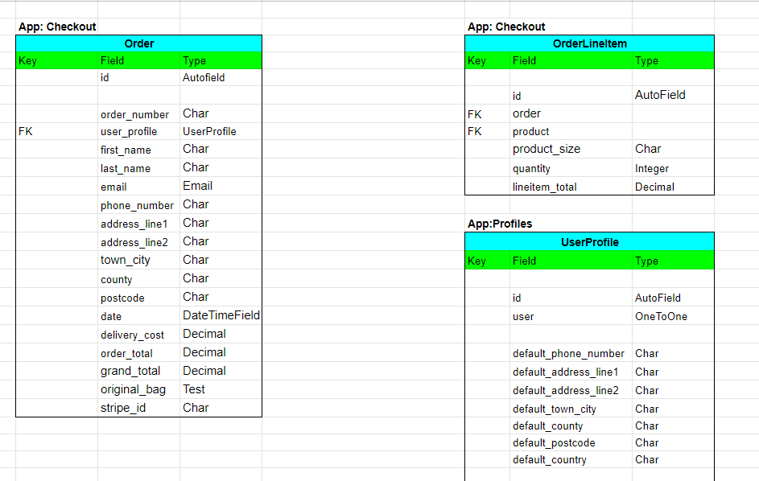
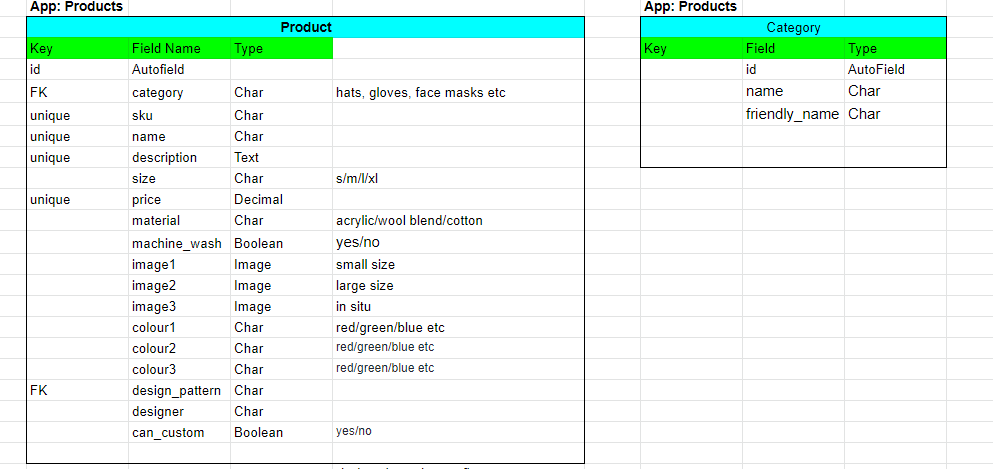

# Knits and Pieces

https://knits-and-pieces.herokuapp.com/
## UX Design
### Strategy
* Introduction
* Agile Planning
User stories (Issues) with acceptance criteria and tasks are each linked to an Epic (Milestone) and placed in an Iteration kanban board (Projects 1, 2 and 3). Due to the project time constraints no dates are included. Each user story is labelled with a must-have should-have, could-have or won't have label to show prioritisation. (Include planning table with prioritistion list here)

* Project Goal

The goal of the project is to create an online store for this developer's handmade items; primarily crocheted throws and blankets, knitted hats and cotton facemasks. This is a real-world application to create a store for this developer's products which have been custom-made and sold on a word-of-mouth basis over ten years. Buyers have encouraged the set-up of an online store to increase sales and customer base.

* Target audience

- People who like colourful, handmade, good quality items. 
- People who like knitted and crocheted items.
- People who want to order custom made throws and blankets in colours of their choosing.
- People looking for unique gifts

* Business Goals

- To create a professional online store
- To provide an easy and secure means to purchase items.
- To increase the customer base
- To create a brand for the store and increase brand awareness
- To encourage subscriptions to the site newsletter

* Customer Goals

- To view the products available
- To buy colourful, handmade items
- To navigate easily through the website
- To be able to pay securely for items
- To be confident that the site is genuine and trustworthy


* User Stories

| User Story ID | As A/An            | I want to be able to                                                | So that I can                                                                                                 |                 |
|---------------|--------------------|---------------------------------------------------------------------|---------------------------------------------------------------------------------------------------------------|-----------------|
|             1 |                    | Viewing and Navigation                                              |                                                                                                               |                 |
|           1.1 | Shopper            | View a list of products                                             | Select some to purchase                                                                                       |                 |
|           1.2 | Shopper            | View individual products                                            | Identify the price, description, product rating, product image and available sizes                            |                 |
|           1.3 | Shopper            | Quickly identify special offers, deals                              | Take advantage of special savings on  products I'd like to purchase                                           |                 |
|           1.4 | Shopper            | Easily view the total of my purchases at any time                   | Keep track of how much I am spending                                                                          |                 |
|           1.6 | Shopper            | View the total number of likes of a product                         | See what other shoppers think of a product                                                                    |                 |
|           1.6 | Registered Shopper | Like/Unlike a product                                               | See which are the most popular products                                                                       |                 |
|           1.7 | Shopper            | View the product reviews                                            | See opinions of products to help decide whether to purchase                                                   |                 |
|           1.8 | Shopper            | View the blog posts                                                 | Find out more information about the products, the website and related topics                                  |                 |
|           1.9 | Shopper            | View store's social media pages                                     | View the site content in different places that I use                                                          |                 |
|             2 |                    | Registration and User Accounts                                      |                                                                                                               |                 |
|           2.1 | Site User          | Easily register for an account                                      | Have a personal account and be able to view my profile                                                        | Install allauth |
|           2.2 | Registered Shopper | Easily login and logout                                             | Access my personal account information                                                                        |                 |
|           2.3 | Registered Shopper | Easily recover my password if I forget it                           | Recover access to my account                                                                                  |                 |
|           2.4 | Registered Shopper | Receive an email confirmation after registering                     | Verify my account information/ registration was successful                                                    |                 |
|           2.5 | Registered Shopper | Have a personalised user profile                                    | View my personal order history and order confirmations and save my payment information                        |                 |
|             3 |                    | Sorting and Searching                                               |                                                                                                               |                 |
|           3.1 | Shopper            | Sort the list of available products                                 | Easily identify the best rated, best priced and items sorted by category                                      |                 |
|           3.2 | Shopper            | Sort a specific category of items                                   | Find the best priced, best rated product in a specific category or sort the products in that category by name |                 |
|           3.3 | Shopper            | Sort multiple categories of products simultaneously                 | Find the best priced, best rated products across broad categories                                             |                 |
|           3.4 | Shopper            | Search for a product by name or description                         | Find a specific product to purchase                                                                           |                 |
|           3.5 | Shopper            | Easily see what I have searched for and the number of results       | Quickly see if the product I want is available                                                                |                 |
|             4 |                    | Purchasing and Checkout                                             |                                                                                                               |                 |
|           4.1 | Shopper            | Easily select the size and quantity of a product when purchasing it | check that I am ordering the correct size and quantity that I intended                                        |                 |
|           4.2 | Shopper            | View items in my bag to be purchased                                | see the total cost of my items and all the items I will receive                                               |                 |
|           4.3 | Shopper            | Adjust the quantity of individual items in my bag                   | Easily make changes to my purchase before checkout                                                            |                 |
|           4.4 | Shopper            | Easily enter my payment information                                 | Checkout quickly and easily                                                                                   |                 |
|           4.5 | Shopper            | Feel that my personal and payment information is safe and secure    | Be confident in providing the necessary information to make a purchase                                        |                 |
|           4.6 | Shopper            | View an order confirmation after checkout                           | Verify that the order is correct and as intended                                                              |                 |
|           4.7 | Shopper            | Receive an email confirmation after checking out                    | Have a record of my purchases                                                                                 |                 |
|           4.8 | Shopper            | Place an order for a custom design                                  | Purchase an item that meets my needs                                                                          |                 |
|           4.9 | Shopper            | Easily contact the store owner with any queries about the products  | Find the answer to my questions                                                                               |                 |
|             5 |                    | Admin and Store Management                                          |                                                                                                               |                 |
|           5.1 | Store Owner        | Add a product                                                       | Add new items to my store                                                                                     |                 |
|           5.2 | Store Owner        | Edit/Update a product                                               | Change product prices, descriptions, images and product criteria                                              |                 |
|           5.3 | Store Owner        | Delete a product                                                    | Remove items that are no longer for sale                                                                      |                 |
|           5.4 | Store Owner        | Add a blog post                                                     | Share articles related to my products to broaden interest in my site                                          |                 |
|           5.5 | Store Owner        | Edit/Update a blog post                                             | Control the blog content                                                                                      |                 |
|           5.6 | Store Owner        | Delete a blog post/comment                                          | Remove content that is not appropriate                                                                        |                 |
|           5.7 | Store Owner        | Approve comments on blog posts                                      | Control the site content                                                                                      |                 |
|             6 |                    | User Interaction                                                    |                                                                                                               |                 |
|           6.1 | Registered Shopper | Review a product that I have bought                                 | So that I can share my opinion of my purchase on the website                                                  |                 |
|           6.1 | Shopper            | Comment on a blog post                                              | Interact with the site content                                                                                |                 |
|           6.2 | Registered Shopper | Update/Delete my comments                                           | Control my own contribution to the site                                                                       |                 |

* SEO and Web Marketing
- SEO 
Keywords in titles as much as possible
Research on short and long-tail keywords was conducted via google searches to find the search words and phrases thatm most related to a site like Knits and Pieces. Handmade was particularly crucial to a good search result when incorporated with the product categories and craft type. Keywords were incorporated into the meta tags and headings where appropriate while not overloading the site content and maintaining the usefulness of the site.
- Web Marketing
Paid web advertising is not currently within the scope of this project. However a newsletter link has been added to the website as an easy way for a small business such as Knits and Pieces to reach customers and keep them up to date with new products, special offers and to keep the ecommerce store fresh.
Newsletter
A Facebook business page was set up for the purposes of this project. This is another method for a small business to reach new customers and retain existing customers. The site is viewable whether or not a user has an account with Facebook. Since the business is not currently live this site may have been taken down. Screenshots are provided in case the link is no longer valid. [Link to Facebook business page](https://www.facebook.com/Knits-and-Pieces-111739761381732)

View of Facebook business page to site owner with Facebook account:


View of Facebook Business page to prospective customer without Facebook account:


A future intention to increase the site's usefulness to customers is to add a craft blog to the site with links to videos on interesting stitches and patterns and links to othe interesting websites and YouTube videos. This would evoke a positive emotional response in customers and in turn build trust and loyalty to the business. It would also provide a means to keep the site up to date, relevant and fresh in customers' minds. 

### Scope
* Functional Requirements
* Content Requirements
* Constraints

- This project is constrained by time. Since this project is firstly to fulfil the requirements of Project Portfolio 5 and must meet a deadline, some of the requirements necessary to make this project a real-world application will be left in the Future Features section for addition after completion of the course.

### Structure
* Information Architecture
* Userflow
* Database Structure
* Models
- Product (Product app)
- Category (Product app)
- Tag (Product app)
- Order (Checkout app)
- OrderLineItem (Checkout app)
- UserProfile (Profiles)
- ContactForm (Contact app)
- CustomOrder (Custom app)






### Skeleton
* Wireframes
The wireframes can be seen here [here](https://github.com/siobhanlgorman/knits-and-pieces/tree/main/documentation/wireframes))


* [Home Page]((https://github.com/siobhanlgorman/knits-and-pieces/blob/main/documentation/wireframes/home-page.png))
* [About Page]((https://github.com/siobhanlgorman/knits-and-pieces/blob/main/documentation/wireframes/about-page.png))
* [Bag Page]((https://github.com/siobhanlgorman/knits-and-pieces/blob/main/documentation/wireframes/bag-page.png))
* [Checkout Page]((https://github.com/siobhanlgorman/knits-and-pieces/blob/main/documentation/wireframes/checkout-page.png))
* [Contact Form Page]((https://github.com/siobhanlgorman/knits-and-pieces/blob/main/documentation/wireframes/contact-form-page.png))
* [Custom Order Form Page]((https://github.com/siobhanlgorman/knits-and-pieces/blob/main/documentation/wireframes/custom-order-form.png))
* [Products Page]((https://github.com/siobhanlgorman/knits-and-pieces/blob/main/documentation/wireframes/products-page.png))
* [Product Detail Page]((https://github.com/siobhanlgorman/knits-and-pieces/blob/main/documentation/wireframes/product-detail-page.png))
* [Register Page]((https://github.com/siobhanlgorman/knits-and-pieces/blob/main/documentation/wireframes/register-page.png))
* [Sign In Page]((https://github.com/siobhanlgorman/knits-and-pieces/blob/main/documentation/wireframes/signin-page.png))
* [Sign Out Page]((https://github.com/siobhanlgorman/knits-and-pieces/blob/main/documentation/wireframes/signout-page.png))

### Surface

* Overall Design Choice
- The emphasis is to look professional and modern and to showcase the high quality artisan goods for sale. Research on websites selling similar handmade goods often have either a very traditional and amateur look or a very cluttered look. The site should look clean and elegant with a plain background to highlight the colorful products. Minimal colours used in keeping with the minimalist approach but making the site attractive to draw user's eye and tone with the products' colours. 

* Colours
- colours changed due to contrast issues
- created a logo from a bright coloured suare from a product
- created a palette using [Coolors](https://coolors.co/d20f35-e36477-3a445c-728668-bbb19d)
- Picked from sample product square, used for logo
- Crimson for Title font
- Charcoal - main font colour #3a3a3a
* Typography
- Cinzel for Titles - fancy, elegant, commanding
* Images
- The images used for the website were all taken and edited by this developer as the ecommerce products are all the developer's own. The approach was to create transparent backgrounds to highlight the products and their colours in isolation and against a plain white background. This was a learning experience and proved more time-consuming than anticipated. As a result some images could be improved given more time but are satisfactory for the purposes of this project. Paint 3D was used to remove the backgrounds, crop and resize the images. [removebg](https://www.remove.bg/upload) was also used where the size reduction did not compromise the quality.
* Accessibility

## Features
### Existing Features
### Future Features

- stock levels
- postage according to country/limiting country
## Languages and Technologies
* [HTML5](https://en.wikipedia.org/wiki/HTML5) was used to build the front-end website
* [CSS](https://en.wikipedia.org/wiki/CSS) was used to style the HTML and add responsiveness
* [JavaScript](https://www.javascript.com/) (no custom JS) was used with Bootstrap to provide interaction on the front-end
* [Bootstrap 4.6](https://getbootstrap.com/docs/4.6/getting-started/introduction/) was used to style the website, add responsiveness and interactivity
* [Python](https://www.python.org/) was used to code the back end of the project
* [PyPI](https://pypi.org/) to install the python packages

Photo Editing
* [Paint3D]
* [Paint]
* [TinyPNG]
* [removebg](https://www.remove.bg/upload)
## Testing
## Deployment

### Heroku Deployment
1. Create Heroku app
install psycopg2 and djdatabase and add to requirements
2. Add postgres database to app resources in heroku and copy db url
3. Attach database to gitpod? : add copied db url
4. Add secret key for django secret key to env.py and heroku config vars
5. Make sure env.py is referenced in settings.py
6. REmove Django insecure key and reference SECRET_KEY in settings.py
7. Point to postgres db in settings.py
8. Make migrations to postgres db
9. install gunicorn and add to requirements
10. Create Procfile: `web: gunicorn knits_and_pieces.wsgi:application`
9. DISABLE_COLLECTSTATIC = 1 in config vars
10. Add heroku Hostname to allowed_hosts in settings.py and local host so gitpod will still work
11. Connect github to repo Knits and Pieces https://github.com/siobhanlgorman/knits-and-pieces
12. Deploy branch
13. Live site https://knits-and-pieces.herokuapp.com/
`````
```````
requirements.txt
### Local Deployment: Forking and Cloning
## Credits

- heavily relied on Boutique Ado for the basis of the project with customisation as much as possible and custom models


Logo created from 
Favicon created from 

## Acknowledgements