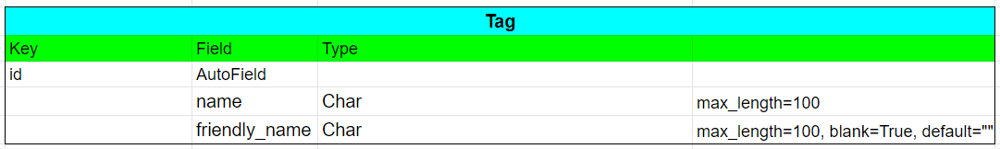
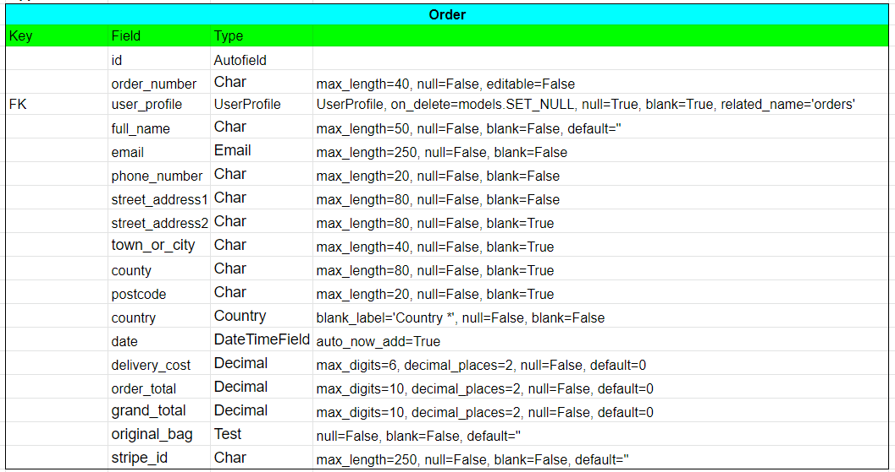
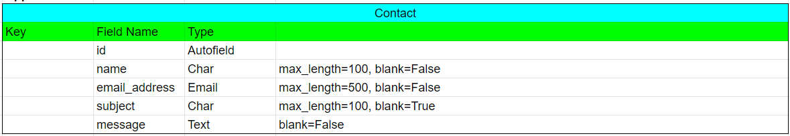
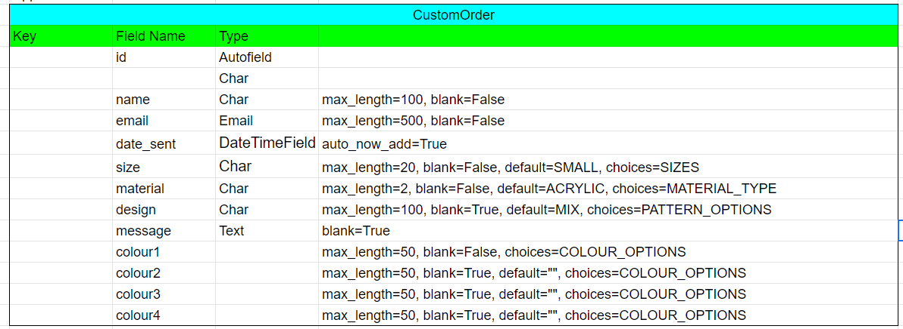

# Knits and Pieces


View the live site [here](https://knits-and-pieces.herokuapp.com)
## UX Design
### Strategy
#### Agile Planning
User stories (Issues) with acceptance criteria and tasks are each linked to an Epic (Milestone) and placed in an Iteration kanban board (Projects 1, 2 and 3). No dates have been included due to the tight timeline and the Christmas hoilday in the middle but these would be required in a working environment. Each user story is labelled with a must-have should-have, could-have or won't have label to show prioritisation. See the table of User Stories [here](#user-stories)

#### Project Goal

The goal of the project is to create an online store for this developer's handmade items; primarily crocheted throws and blankets, knitted hats and cotton facemasks. This is a real-world application to create a store for this developer's products which have been custom-made and sold on a word-of-mouth basis over ten years. These customers have encouraged online sale of their purchases so this website is answering to that demand.

#### Target audience

- People who like colourful, handmade, good quality items. 
- People who like knitted and crocheted items.
- People who want to order custom made throws and blankets in colours of their choosing.
- People looking for unique gifts

#### Business Goals

- To create a professional online store
- To provide an easy and secure means to purchase items.
- To increase the customer base
- To create a brand for the store and increase brand awareness

#### Customer Goals

- To view the products available
- To buy colourful, handmade items
- To navigate easily through the website
- To be able to pay securely for items
- To be confident that the site is genuine and trustworthy


#### User Stories

Using the Agile approach Epics (Github Milestones) were created and broken down into several User Stories (Github Issues). User Stories were fleshed out with Acceptance Criteria and Tasks assigned to each. Acceptance criteria were used in measuring testing outcomes. Due to the time constraints and knowledge level of this developer it was not possible in every case to decide the tasks in advance of carrying out the work although this would be the ideal in a workplace environment. 

User Stories were sorted into four priority levels with 1 as top priority and 4 as least prioritised. User Stories with Priority 1 were allocated a label of 'must-have', 2 as 'should-have', 3 as 'could-have'. These User Stories were divided into three Iterations (Github Projects). For the purposes of this project a timeframe was not assigned although in a real world environment it would be. Those User Stories allocated Priority 4 which would be 'won't have' were not placed in the table but are included in [Future Features](#future-features). Several stories marked as 'could-have' were not completed due to time constraints (#5, #7, #29 #30) but remain in the Project board.

| User Story ID | As A/An | I want to be able to | So that I can | | # | Priority | Iteration |
|---------------|--------------------|----------------------------------------------------------------------------|---------------------------------------------------------------------------------------------------------------|---|-----|----------|----------:|
| EPIC | | Enable users to view and navigate the site | | | | | |
| 1 | | Viewing and Navigation | | | | | |
| 1.1 | Shopper | View a list of products | Select some to purchase | | [#1](https://github.com/siobhanlgorman/knits-and-pieces/issues/1) | 1 | 1 |
| 1.2 | Shopper | View individual products with all relevant details | See the price, description, material, product image and size | | [#2](https://github.com/siobhanlgorman/knits-and-pieces/issues/2) | 1 | 1 |
| 1.3 | Shopper | Easily identify special information about products eg discounts | Take advantage of special information on products I'd like to purchase | | [#3](https://github.com/siobhanlgorman/knits-and-pieces/issues/3) | 3 | 1 |
| 1.4 | Shopper | Easily view the total of my purchases at any time | Keep track of how much I am spending | | [#4](https://github.com/siobhanlgorman/knits-and-pieces/issues/4) | 2 | 2 |
| 1.5 | Shopper | Easily view the number of purchases in my basket at any time | Know how many items I have already added to my basket | | [#5](https://github.com/siobhanlgorman/knits-and-pieces/issues/5) | 3 | 2 |
| 1.6 | Shopper | View more information about the store | Increase my confidence that the store is genuine, trustworthy and reliable to purchase from | | [#6](https://github.com/siobhanlgorman/knits-and-pieces/issues/6) | 1 | 2 |
| 1.7 | Shopper | View reviews of a product | decide whether the product is good enough to purchase | | [#7](https://github.com/siobhanlgorman/knits-and-pieces/issues/7) | 3 | 2 |
| | | | | | | | |
| 1.8 | Shopper | View store's social media pages | View the site content in different places that I use | | [#8](https://github.com/siobhanlgorman/knits-and-pieces/issues/8) | 1 | 1 |
| | | | | | | | |
| 1.9 | Shopper | View the average rating of a product | See how good the quality of the product and service is | | | 3 | 2 |
| 1.1O | Shopper | View a list of FAQs | Easily find the answer to common questions | | | 4 | F |
| 1.11 | Shopper | View Blog posts | Read interesting articles related to the products and the website | | | 4 | F |
| 1.12 | Registered Shopper | Save my liked products to a wishlist in my profile | Decide which of my liked products I will buy | | | 4 | F |
| EPIC | | Enable users to create and manage their account | | | | | |
| 2 | | Registration and User Accounts | | | | | |
| 2.1 | Shopper | Easily register for an account | Have a personal account and be able to view my profile | | [#9](https://github.com/siobhanlgorman/knits-and-pieces/issues/9) | 1 | 1 |
| 2.2 | Registered Shopper | Easily login and logout | Access my personal account information | | [#10](https://github.com/siobhanlgorman/knits-and-pieces/issues/10) | 1 | 1 |
| 2.3 | Registered Shopper | Easily recover my password if I forget it | Recover access to my account | | [#11](https://github.com/siobhanlgorman/knits-and-pieces/issues/11) | 1 | 1 |
| 2.4 | Registered Shopper | Receive an email confirmation after registering | Verify my account information/ registration was successful | | [#12](https://github.com/siobhanlgorman/knits-and-pieces/issues/12) | 1 | 1 |
| 2.5 | Registered Shopper | Have a personalised user profile | View my personal order history and order confirmations and save my payment information | | [#13](https://github.com/siobhanlgorman/knits-and-pieces/issues/13) | 1 | 3 |
| 2.6 | Shopper | Social media registration | Streamline registration for multiple accounts | | | 3 | F |
| EPIC | | Enable users to sort and search for products | | | | | |
| 3 | | Sorting and Searching | | | | | |
| 3.1 | Shopper | Sort the list of available products | Easily identify the best rated, best priced and items sorted by category | | [#14](https://github.com/siobhanlgorman/knits-and-pieces/issues/14) | 1 | 2 |
| 3.2 | Shopper | Sort a specific category of items | Find the best priced, best rated product in a specific category or sort the products in that category by name | | [#15](https://github.com/siobhanlgorman/knits-and-pieces/issues/15) | 1 | 2 |
| 3.3 | Shopper | Sort multiple categories of products simultaneously | Find the best priced, best rated products across broad categories | | [#16](https://github.com/siobhanlgorman/knits-and-pieces/issues/16) | 1 | 2 |
| 3.4 | Shopper | Search for a product by name or description | Find a specific product to purchase | | [#17](https://github.com/siobhanlgorman/knits-and-pieces/issues/17) | 1 | 2 |
| 3.5 | Shopper | Easily see what I have searched for and the number of results | Quickly see how many products are available | | [#18](https://github.com/siobhanlgorman/knits-and-pieces/issues/18) | 2 | 2 |
| EPIC | | Enable users to select and purchase products securely | | | | | |
| 4 | | Purchasing and Checkout | | | | | |
| 4.1 | Shopper | Easily select the quantity of a product when purchasing it | Check that I am ordering the correct quantity that I intended | | [#19](https://github.com/siobhanlgorman/knits-and-pieces/issues/19) | 1 | 1 |
| 4.2 | Shopper | View items in my basket to be purchased | See the total cost of my items and all the items I will receive | | [#20](https://github.com/siobhanlgorman/knits-and-pieces/issues/20) | 1 | 3 |
| 4.3 | Shopper | Adjust the quantity of individual items in my basket | Easily make changes to my purchase before checkout | | [#21](https://github.com/siobhanlgorman/knits-and-pieces/issues/21) | 1 | 3 |
| 4.4 | Shopper | Easily enter my payment information | Checkout quickly and easily | | [#22](https://github.com/siobhanlgorman/knits-and-pieces/issues/22) | 1 | 3 |
| 4.5 | Shopper | Feel that my personal and payment information is safe and secure | Be confident in providing the necessary information to make a purchase | | [#23](https://github.com/siobhanlgorman/knits-and-pieces/issues/23) | 1 | 3 |
| 4.6 | Shopper | View an order confirmation after checkout | Verify that the order is correct and as intended | | [#24](https://github.com/siobhanlgorman/knits-and-pieces/issues/24) | 1 | 2 |
| 4.7 | Shopper | Receive an email confirmation after checking out | Have a record of my purchases | | [#25](https://github.com/siobhanlgorman/knits-and-pieces/issues/25) | 1 | 2 |
| EPIC | | Set up adminstration to manage the site users and content | | | | | |
| 5 | | Admin and Store Management | | | | | |
| 5.1 | Store Owner | Add a product | Add new items to my store | | [#26](https://github.com/siobhanlgorman/knits-and-pieces/issues/26) | 1 | 3 |
| 5.2 | Store Owner | Edit/Update a product | Change product prices, descriptions, images and product criteria | | [#27](https://github.com/siobhanlgorman/knits-and-pieces/issues/27) | 1 | 3 |
| 5.3 | Store Owner | Delete a product | Remove items that are no longer for sale | | [#28](https://github.com/siobhanlgorman/knits-and-pieces/issues/28) | 1 | 3 |
| 5.4 | Store Owner | Add a blog post | Share articles related to my products to broaden interest in my site | | | 4 | F |
| 5.5 | Store Owner | Edit/Update a blog post | Control the blog content | | | 4 | F |
| 5.6 | Store Owner | Delete a blog post/comment | Remove content that is not appropraite | | | 4 | F |
| 5.7 | Store Owner | Approve comments on blog posts | Control the site content | | | 4 | F |
| EPIC | | Enable users to interact with the online store | | | | | |
| 6 | | User Interaction | | | | | |
| 1.8 | Shopper | Like a product | Pick out and view the products that I like | | [#29](https://github.com/siobhanlgorman/knits-and-pieces/issues/29) | 3 | 3 |
| 6.1 | Registered Shopper | Review a product that I have bought | So that I can share my opinion of my purchase on the website | | [#30](https://github.com/siobhanlgorman/knits-and-pieces/issues/30)| 3 | 3 |
| 6.2 | Shopper | Request a quote for a custom order | Purchase an item that meets my needs | | [#31](https://github.com/siobhanlgorman/knits-and-pieces/issues/31) | 3 | 3 |
| 6.3 | Shopper | Easily contact the store owner with any queries about the products | Find the answer to my questions | | [#32](https://github.com/siobhanlgorman/knits-and-pieces/issues/32) | 2 | 3 |
| 6.4 | Shopper | Feedback from the website when I perform an interaction | confirm an interaction has taken place and if an error has occurred | | [#33](https://github.com/siobhanlgorman/knits-and-pieces/issues/33) | 1 | 1 |
| | | | | | | | |
| | | Other Future Features | | | | | |
| 7.1 | Shopper | View the blog posts | Find out more information about the products, the website and related topics | | | 4 | F |
| 7.2 | Shopper | Comment on a blog post | Interact with the site content | | | 4 | F |
| 7.3 | Registered Shopper | Update/Delete my blog comments | Control my own contribution to the site | | | 4 | F |
| 7.4 | Registered Shopper | Update/Delete my reviews | Control my own contribution to the site | | | 3 | 3 |
| 4.8 | Shopper | Cancel orders that have not been shipped | Change my mind about a purchase | | | 4 | F |
| 5.8 | Store Owner | Keep account of current stock numbers and link to available stock for sale | Only sell products which I can supply | | | | |

#### SEO and Web Marketing
- SEO 

Research on short and long-tail keywords was conducted via google searches to find the search words and phrases that most related to a site like Knits and Pieces. Handmade was particularly crucial to a good search result when incorporated with the product categories and craft type. Keywords were incorporated into the meta tags and headings where appropriate while not overloading the site content and maintaining the usefulness of the site.
- Web Marketing

Paid web advertising is not currently within the scope of this project. However a newsletter link has been added to the website as an easy way for a small business such as Knits and Pieces to reach customers and keep them up to date with new products, special offers and to keep the ecommerce store fresh.
- Facebook Business Page

A Facebook business page was set up for the purposes of this project. This is another method for a small business to reach new customers and retain existing customers. The site is viewable whether or not a user has an account with Facebook. Since the business is not currently live this site may have been taken down. Screenshots are provided in case the link is no longer valid. [Link to Facebook business page](https://www.facebook.com/Knits-and-Pieces-111739761381732)

View of Facebook business page to site owner with Facebook account:


View of Facebook Business page to prospective customer without Facebook account:


- In future a feature such a craft blog would be a useful addition to this type of website which would increase the site's usefulness to customers with links to videos on interesting stitches and patterns. This would evoke a positive emotional response in customers and in turn build trust and loyalty to the business. It would also provide a means to keep the site up to date, relevant and fresh in customers' minds. 

- Privacy Policy

A privacy policy is a legal requirement because of GDPR legislation. This also benefits the website as it looks professional and more importantly inspires trust in the website user. A link to the privacy policy page is included in the footer.
### Scope
- Requirements

The approach taken was to create a minimum viable product which in this case was to create a functioning ecommerce store with the ability to view and purchase a product via a seamless payment facility (in this case Stripe).

The User Stories were prioritised as described [above](#user-stories) and shown in the table with functional requirements prioritised as 1
* Constraints

The time frame for this project was extremely short and broken up with Christmas holidays. In addition, the time to learn and become familiar with the languages and tools necessary to have a good understanding of the development process was short. As a result there are many improvements to be made in the future but a basic and functioning ecommerce store has been created which fulfils the requirements.
### Structure

????
The website consists of pages: Home, Shop, About, Custom Order, Profile
### Database
For this project the PostgresSql database was used from the outset. Since fixtures were not being used and the number of products was relatively small this meant the products could be added to the deployed database from the beginning and so saving some time.
#### Models
There are eight models in this project (excluding those which are automatically created by Django). Four models have been specifically customised for the purposes of this ecommerce store: Product, Tag, ContactForm and CustomOrderForm

- Products App Models

In the Products app there are three models: Product, Category and Tag. The Product model is specifically designed for this project with customised fields specific to handmade products. The tag model was developed to display special information relating to several products but not all. The Product model links to the Category and Tag model by a Foreign Key. The product model initially had two more image fields (highlighted in the model screenshot) as the intention was for a more detailed product template showing the product in different situations. However due to the time involved in creating and sizing professional photos the model was scaled back for this initial version of the ecommerce store and the fields were then removed. Also a likes field (highlighted was included initially to add to a function where the user would like a product and add to a wishlist. Again due to time constraints this was removed as a feature for this version of the store.




- Checkout App

In the Checkout app there are two models. The Order and OrderLineItem contain the information for the user to create a purchase order. The Order model links to the user profile model in the Profiles App by a foreign key. The OrderLineItem model refers to each specific product in the order and links to the Order and Products models by a foreign key.




- Profiles App

In the Profiles app there is a UserProfile model which uses the Django default User model.


- Contact App

In the Contact App there is a custom ContactForm model for the customer to send a message to the Knits and Pieces store.



- Custom App

The Custom App has a specifically customised CustomOrder model for a customer to request a quote to have a particular product (Blanket) made to order in a choice of colours, sizes and patterns. It was originally intended to link this to the Product model but in as this was being added later in development it was not possible as some of the fields should have been separate models from the beginning and linked via foreign keys. Due to time constraints and lack of expertise in the planning stage this was not foreseen and could not have been undertaken in the later stages of the project.


### Skeleton
#### Wireframes
- The wireframes can be seen [here](https://github.com/siobhanlgorman/knits-and-pieces/tree/main/documentation/wireframes)

* [Home Page](https://github.com/siobhanlgorman/knits-and-pieces/blob/main/documentation/wireframes/home-page.png)
* [About Page](https://github.com/siobhanlgorman/knits-and-pieces/blob/main/documentation/wireframes/about-page.png)
* [Bag Page](https://github.com/siobhanlgorman/knits-and-pieces/blob/main/documentation/wireframes/bag-page.png)
* [Checkout Page](https://github.com/siobhanlgorman/knits-and-pieces/blob/main/documentation/wireframes/checkout-page.png)
* [Contact Form Page](https://github.com/siobhanlgorman/knits-and-pieces/blob/main/documentation/wireframes/contact-form-page.png)
* [Custom Order Form Page](https://github.com/siobhanlgorman/knits-and-pieces/blob/main/documentation/wireframes/custom-order-form.png)
* [Products Page](https://github.com/siobhanlgorman/knits-and-pieces/blob/main/documentation/wireframes/products-page.png)
* [Product Detail Page](https://github.com/siobhanlgorman/knits-and-pieces/blob/main/documentation/wireframes/product-detail-page.png)
* [Register Page](https://github.com/siobhanlgorman/knits-and-pieces/blob/main/documentation/wireframes/register-page.png)
* [Sign In Page](https://github.com/siobhanlgorman/knits-and-pieces/blob/main/documentation/wireframes/signin-page.png)
* [Sign Out Page](https://github.com/siobhanlgorman/knits-and-pieces/blob/main/documentation/wireframes/signout-page.png)

### Surface

#### Overall Design Choice
- The emphasis is to look professional and modern and to showcase the high quality artisan goods for sale. Research on websites selling similar handmade goods often have either a very traditional and amateur look or a very cluttered look. The more upmarket sites have a clean, elegant look with a plain background to highlight the colorful products. Minimal colours are used in keeping with this clean and fresh look and make the site attractive to draw user's eye. For this project minimal colours were used to highlight the colourful products against a plain background. Image backgrounds were removed to focus on the products and to look professionally created. 

#### Colours
Colours for the site were chosen by colour picking a main colour from a product image using [Coolors](https://coolors.co/). The main colour selected was crimson and shades of grey chosen to contrast with beige for the footer. However during development contrast issues arose so the shades of colours used were adjusted to fix the issues without changing colours completely.


Buttons were red and grey to match the overall colour scheme. On hover the buttons darken a shade.


Green was used to highlight edit or update buttons with red for remove/delete


- created a palette using [Coolors](https://coolors.co/d20f35-e36477-3a445c-728668-bbb19d)

- The crimson colour was used for the main titles on pages.

- Charcoal was used for the main font colour as it is less harsh on a white background than black - #3a3a3a

#### Typography

- [Cinzel](https://fonts.google.com/specimen/Cinzel) was used for Titles and special text where the intention was to highlight the Knits and Pieces brand. This font is fancy, elegant and commanding
- [Roboto](https://fonts.google.com/specimen/Roboto) was used for the body font

#### Images

- The images used for the website were all taken and edited by this developer as the ecommerce products are all the developer's own. The approach was to create transparent backgrounds to highlight the products and their colours in isolation and against a plain white background. This was a learning experience and proved more time-consuming than anticipated. As a result some images could be improved given more time but are satisfactory for the purposes of this project. [Paint 3D](https://www.microsoft.com/en-us/p/paint-3d/9nblggh5fv99?activetab=pivot:overviewtab) was used to remove the backgrounds, crop and resize the images. [Removebg](https://www.remove.bg/upload) was also used where the size reduction did not compromise the quality.

#### Accessibility

WAVE

????? Test this somewhere?
## Features
### Existing Features
#### Features on All Pages:
#### Navbar
- Logo - Ball of wool in crimson brand colour. links to home page. Sits on left as is usual.
- Page Links: On large screens the main page links are on the left: Home, Shop, About and Order pages. - On medium screens and smaller the main page links are compressed into a burger menu icon on the right which opens into a dropdown menu on the right
- The Shop page link features a dropdown menu. Users can choose to view all products or to sort or filter products by price, name or category. Categories which can be chosen from the menu are grouped together into broad categories that a customer might choose to see together: throws and blankets, hats and gloves, cushion covers and facemasks. When a category is selected the specific category badges appear above the products listing to enable the customer to further sort by category
- Search Box - On large screens a search box appears to the right of the top menu. Users can enter a single word to search within the title or description of a product. Users can click enter or the magnifying glass icon to enter the search. The products list is then filtered by the search term and resulting products are displayed with the number of results displayed above. If no products are found '0 products found' is displayed. On smaller screens the search box is contained in the burger dropdown menu.
- Profile Icon: On large screens the profile icon is to the right of the search box. This contains a dropdown menu which opens when clicked. For a user who is not logged in the options in the dropdown are links to the Register page and the Login page. For a user who is logged in the dropdown options are Add a Product, My Profile and Logout. On smaller screens the profile icon appears centrally to the right of the shopping basket.
- Shopping Basket: On large screens the shopping basket appears on the top right of the menu. The basket is coloured red in keeping with the brand colur and to make it stand out in the menu. When clicked the icon opens up the current basket page. Beside the basket is an indicator of the total cost of the items currently in the basket, also coloured red to match the basket. On smaller screens the basket icon is positioned centrally to the left of the profile icon.
- When the navigation page menu links are hovered over their colours are inverted to grey background and white font colour. 
- Header with navbar sticks to the top of the screen as the user scolls on larger screens but not on smaller screens where
- A banner is at the top of each page under the navbar, coloured in the crimson brand colour to draw attention to special information - the free delivery threshold and an embedded link to special offers/special items tagged items
#### Footer
- The footer is divided into three sections: Shop links to the shop products by category or tag, Quick Links to the main shop pages and a contact page, and a section with the social media and contact icons and newsletter links. 
- When the user clicks on the Contact page link or the envelope icon the Contact page form opens. The two links to the contact contact page are only found in the footer as this is where the user expects to find them. 
- The social media links include a direct link to FB business page while the other social media links do not currently link directly to business pagea as the business is not currently live. 
- At the bottom is copyright information and a link to the developer's GitHub page. 
- On medium and large screens the shop links are on the left, quick links on the right and social media, newsletter, copyright in the middle section. On smaller screens the Shop links are at the top, followed by newsletter and social media, then Quick Links and copyright at the bottom. 
- The footer also features the brand logo image in the center which links to the home page.
- The Subscribe section contains an embedded mailchimp signup form with CTA Subscribe button and an input box to enter the user's email address
- A Page title features prominently on all pages in the title font and the brand colour.
#### Home Page
- Under the title is a carousel featuring images of three main product categories with links in the image title to the relevant category page
- Under the carousel is some introductory text about the store and an embedded link to the Order page where Users can order a custom item
- Below the text are two CTA buttons one to the main Shop page and the other to the About page with more information about the store. 
#### About Page
- Features a photograph of the store owner with information about the history of the store. 
- CTA button to the Shop page
- On larger screens the photo and text appear side by side which collapses to one underneath the other on smaller screens
#### Shop Page/ All Products
- When all products is selected in the navigation menu the product are listed in rows of four on extra-large screens, three on large screens, two on medium and one on small screens
- Above the products list on the left on medium screens and up is text specifying the number of products. 
- Above the products list on the right is a sort selector box to sort products by category, price, name
- The number of products text and sort selector box appear in the centre above the products list on small screens
- Each product image in the product list links to its product detail page
- Edit/delete buttons are visible to superuser/administrator under the product price
- When products listed have been selected by category in the navigation menu, category badges are seen from where the user can further sort the products
#### Product Detail Page
- Each product detail page features a large image of the product
- Product details - name, price, description, colours(1-4), material, size, machine washable, designer
- If the item is available to be custom ordered (currently only the various blankets), this is viewable in the description with a link to the custom order page
- Category label can be clicked to view more of this category
- Edit/delete buttons are visible to superuser/administrator under the product name
- A quantity selector box with + - selector to increase/decrease quantity of item. Usere can also enter number or use arrows inside box to increase/decrease quantity of item
- Two buttons - one grey to return to main Shop page and one crimson to add item(s) to shopping basket
- On larger screens the photo appears on the left and description to the right which collapses vertically into two coloumns on smaller screens
#### Order Page - Custom Order
- This page features a form for the user to request a quote to custom order a throw or blanket to their size and colour specifications
- At the top of the page is a carousel of pattern images from which customer can select the design they wish to order in the form
- Below the carousel is a form for user to input name, email, choice of sizes/material/up to four colour choices and a design. Default options are set for size and material and a default of 'mix' for design if the user has no preference. Name, email and main colour are required fields for the user to input. Further details can also be entered in a message box.
- A request quote button clearly indicates the purpose of the form and submits the form.
#### Add a Product Page
- The Add a Product page can only be accessed by the administrator/superuser and is only visible in the navbar menu is te user is logged in as administrator or superuser.
- This page features a form for the administrator/superuser to add a product with fields from the product model: category options, name, size options, description, optional tag, price, material (with default acrylic), machine wash checkbox with default checked, image selection box, up to four colour selction boxes with at least one required, pattern name, deigner and whether the item can be custom ordered with no as default.
- The form to edit a product accessed by the admistrator from the products or product detail page is the same form as for add a product with the fields auto completed which can be changed by the administrator.
#### My Profile Page
- The link to this page can only be seen if a user is logged in
- On the left the default delivery information is displayed if the user has selected save my information during the chackout process.
- The user can change the default information by entering information into the fields
- A green update button is below the delivery information form which can be clicked to submit and save changed information
- This page can only be accessed by the user who is signed in
- On the right the user's order history is displayed in a table with order number, date of order, items ordered and the order total. The Order number is truncated but on hover the full number can be viewed. On click the full past order confirmation is displayed
#### Contact Page
- Accessed from envelope icon in footer and Contact link in Quick Links in footer
- Features a form with input fields: name, subject, email address and text box for a message
- All fields are required so that site owner has the necessary information to reply
- At the bottom of the form is a Send button to submit the message
#### Register Page
- Features a form with input boxes for email and email confirmation, username, password and password confirmation
- Two buttons, signup and back to login page
#### Login Page
- Features a form with input boxes for required fields username and password
- Two buttons are featured at the bottom of the form for home and sign in
#### Basket Page
- Features summary information of products added to basket: image of products, title, size, price, delivery cost and total
- A quantity selector box can be used to changed the quantity of basket items
- Two buttons are visible to update quantity total and remove items in one go from the basket
- Two CTA buttons are at the bottom of the form for users to return to the shop pr checkout
#### Checkout Page
- The Checkout page features input boxes for the necessary payment information inputs: name, email, phone number, street address, town or city, country, post code, country
- At the bottom is the box for card payment information for Stripe. For testing purposes the number 4242 4242 4242 4242 is used
- Two selectors are at the bottom to return to adjust the basket or complete order buttons to complete the payment process
#### 404 page
A 404 page was created to handle users' navigational errors and to direct them back to the website. The navigation menu and logo are visible on the page

#### 500 page
A 500 server error page was created to handle internal server errors

#### Messages
- Feedback messages are shown whenever the user interacts with the site.
### Future Features
- craft blog with users able to comment
- user reviews of products and with CRUD function
- Likes/favourites and a wishlist in the user profile
- link product availablility to stock levels/inventory would be required for a reql-world business
- postage according to country/limiting country
- FAQs section
## Languages and Technologies
### Languages
* [HTML5](https://en.wikipedia.org/wiki/HTML5) was used to build the front-end website
* [CSS](https://en.wikipedia.org/wiki/CSS) was used to style the HTML and add responsiveness
* [JavaScript](https://www.javascript.com/) (no custom JS) was used with Bootstrap to provide interaction on the front-end
* [Bootstrap 4.6](https://getbootstrap.com/docs/4.6/getting-started/introduction/) was used to style the website, add responsiveness and interactivity
* [Python](https://www.python.org/) was used to code the back end of the project
* [PyPI](https://pypi.org/) to install the python packages
### Frameworks
* [Django 3.2.8](https://docs.djangoproject.com/en/3.2/)
* Django supporting libraries:
 - [allauth](https://django-allauth.readthedocs.io/en/latest/installation.html) for authentication, registration, account management as well as 3rd party (social) account authentication
 - [crispy-forms](https://django-crispy-forms.readthedocs.io/) to style the forms
 - [gunicorn](https://gunicorn.org/) as the server for Heroku
 - [psycopg2](https://pypi.org/project/psycopg2/)as an adaptor for Python and PostgreSQL databases
 - [dj-database](https://pypi.org/project/dj-database-url/) to parse the database URL from the environment variables in Heroku
## Database
* Heroku Postgres was used for the production database
* Postgres was used for the development database also
## Other Technologies
* [Amazon Web Services](https://aws.amazon.com/) was used to host the static files and media
* [Gitpod](https://github.com//) as the IDE
* [Git](https://git-scm.com/) used for version control via the terminal in Gitpod
* [GitHub](https://github.com/) used to store the code in the repository
* [Heroku](https://www.heroku.com/) was used as the cloud based platform for deployment
* [Fontawesome](https://fontawesome.com/) for icons
* [Google Fonts](https://fonts.google.com/) for the fonts
* [Balsamiq](https://balsamiq.com/) for the wireframes
* [Google Chrome Dev Tools](https://developer.chrome.com/docs/devtools/) for inspection during development to check reponsiveness, contrast and JS errors in the console
* [Favicon.io](https://favicon.io/favicon-converter/) for the favicon
* [Techsini](https://techsini.com/multi-mockup/index.php) was used for the site mockups
* [Google Chrome](https://www.google.com/intl/en_ie/chrome/) for previewing the project in the browser
* [Google Sheets](https://www.google.com/sheets/about/) - for the database model tables
* [Freelogodesign](https://www.freelogodesign.org/) for the leaf logo
* [W3C Markup Validation Service](https://validator.w3.org/)
* [W3C CSS Validation Service(Jigsaw)](https://jigsaw.w3.org/css-validator/)
* [PEP8](https://www.python.org/dev/peps/pep-0008/) to validate the Python code
* [JSHint](https://jshint.com/) was used to check for errors in Javascript
* [Coolors](https://coolors.co) was used to generate the colour palettes
Photo Editing
* [Paint3D] was used to style the images and create transparent backgrounds
* [Paint] was used to resize images
* [TinyPNG](https://tinypng.com/) was used to resize images for the website
* [removebg](https://www.remove.bg/upload) was also used to remove backgrounds from images
## Testing
Please see separate Testing.md file [here](https://github.com/siobhanlgorman/knits-and-pieces/blob/main/TESTING.md)
## Deployment
### Heroku Deployment
#### 1. Create your Heroku app
* Navigate to the Heroku website
* In the Heroku browser window, create an account by entering your email address and a password
* Activate the account through the authentication email sent to your email account
* Click the new button and select create a new app from the dropdown menu
* Enter a name for the application which must be unique, in this case the app name is 'favoureats'
* Select a region, in this case Europe
* Click create app
* Install psycopg2 and djdatabase in the IDE and add to requirements
* Add postgres database to app resources in heroku and copy db url
#### 3. Create the Database
* Install psycopg2 and djdatabase in the workspace and add to requirements.txt
* In the Heroku dashboard click on the Resources tab
* Scroll down to Add-Ons, search for and select 'Heroku Postgres'
* In the Settings tab, scroll down to 'Reveal Config Vars' and copy the text in the box beside DATABASE_URL.
#### 4. Set up Environment Variables
* In Gitpod create a new env.py file in the top level directory
* Add env.py to the .gitignore file
* In env.py import the os library
* In env.py add `os.environ["DATABASE_URL"]` = "Paste in the text link copied above from Heroku DATABASE_URL" from step 3
* In env.py add `os.environ["SECRET_KEY"] = "Make up your own random secret key"`
* In Heroku Settings tab Config Vars enter the same secret key created in env.py by entering 'SECRET_KEY' in the box for 'KEY' and your randomly created secret key in the 'value' box.
* Make sure env.py is referenced in settings.py:
```
from pathlib import Path
import os
import dj_database_url

if os.path.isfile("env.py"):
import env
```
* Reference Django SECRET_KEY in settings.py
```
SECRET_KEY = os.environ.get('SECRET_KEY')
```
* DISABLE_COLLECTSTATIC = 1 should be set until aws is set up to host media and static when this should be removed in config vars
#### 5. Connect the workspace to the Postgres Database
* Point to postgres db in settings.py by commenting out the `DATABASES` section in settings.py and replace with:
```
DATABASES = {
 'default': 
 dj_database_url.parse(os.environ.get("DATABASE_URL"))
 }`
```

* Make migrations to postgres db
* Install gunicorn in the workspace and add to requirements
* Create Procfile: `web: gunicorn knits_and_pieces.wsgi:application`
* Add Heroku hostname to allowed_hosts in settings.py and local host so gitpod will still work
```
ALLOWED_HOSTS = ['knits-and-pieces.herokuapp.com', 'localhost']
```
#### Deploy from Heroku: 
* Click Deploy tab in Heroku
* In the 'Deployment method' section select 'Github' and click the 'connect to Github' button to confirm.
* In the 'search' box enter the Github repository name for the project: favoureats: https://github.com/siobhanlgorman/knits-and-pieces
* In the IDE when development is complete change the debug setting to: `DEBUG = False` in settings.py
* Click deploy branch

**Note**
At final deployment stage the requirements.txt file contains the following:
LINK TO FILE
You can install these ....


At final deployment stage the heroku config vars file contains the following:


The live site link is https://knits-and-pieces.herokuapp.com/

### Local Deployment: Forking and Cloning
#### Forking the Repository

* To fork the project navigate to the favoureats repository at https://github.com/siobhanlgorman/knits-and-pieces
* Above the list of files click the dropdown code menu.
* Select the https option and copy the link.
* Open the terminal.
* Change the current working directory to the desired destination location.
* Click the 'Fork' button at the top right of the page. A forked copy of the repository will appear in your Repositories page.


#### Cloning the Repository
* On Github navigate to the main page of Favoureats at https://github.com/siobhanlgorman/knits-and-pieces
* Above the list of files click the Code dropdown code menu.
* Select the https option and copy the link.
* Open the terminal.
* Change the current working directory to the desired destination location.
* Type the git clone command with the copied URL: 
`https://github.com/siobhanlgorman/knits-and-pieces.git`.
* Press enter to create the local clone.
* For the project to run an env.py file must be created as detailed above. As this is not stored in Github it will not be cloned with the rest of the files.

## Credits

- Boutique Ado was relied on heavily for the basis of the project with customisation as much as possible and custom models
- The Logo was created from [Free Logo Design](https://www.freelogodesign.org/)
- The favicon was created from [Favicon.io](https://favicon.io/favicon-converter/)
* [Stack Overflow](https://stackoverflow.com/) and [Slack](https://slack.com/) were used for general queries
## Acknowledgements