# Knits and Pieces Testing
## Manual Testing
Thorough testing was conducted by the developer and multiple users among friends and family especially with order creation, updating totals, editing line items. Bugs were found and fixed as detailed below in Bugs section. Testing steps and results are detailed as follows.

## User Stories Testing

For User Story testing first navigate to the [Knits and Pieces website](https://knits-and-pieces.herokuapp.com/)

* **As a shopper I want to be able to view a list of products so that I can select some to purchase [#1](https://github.com/siobhanlgorman/knits-and-pieces/issues/1)**

**Acceptance Criteria**: User can view list of products with image, title and price on Shop page

**Testing Steps**:
1. Without logging in to the site click on the Shop link in navigation menu to open dropdown menu
2. Click on All Products link to open up Shop page
3. View list of products
4. Click on category label link

**Expected Result**:
- Shop page opens
- Products display
- Image and summary detail are visible
- Link works as expected

**Actual Result**:
- Shop page with list of individual products is displayed
- Image and summary detail are visible
- Link works as expected

**Pass/Fail: Pass**

* **As a shopper I want to be able to view individual products with all relevant details so that I can select some to purchase [#2](https://github.com/siobhanlgorman/knits-and-pieces/issues/2)**

**Acceptance Criteria**: User can click on product image or text in Shop page to open full page detail

**Testing Steps**:
1. Without logging in from the Shop page (see User Story test #1), click on a product image
2. Click on category label link
2. Click on embedded link to custom order page if visible

**Expected Result**:
- Product detail card opens when product image is clicked
- Full product detail card is displayed
- All links in card work correctly

**Actual Result**:
- Product detail card opens when product image is clicked
- Full product detail card is displayed
- All links in card work correctly

**Pass/Fail: Pass**

* **As a shopper I want to be able to easily identify special information about products eg discounts so that I can see the price, description, material, product image and size [#3](https://github.com/siobhanlgorman/knits-and-pieces/issues/3)**

**Acceptance Criteria**:  Tag is visible on products tagged with special information e.g. 'last few remaining', 'special offer' etc on Shop page and Product Detail Page. Products with tags can be accessed from navigation menu and link in banner

**Testing Steps**:
1. Click on Shop link in navigation menu to open dropdown menu
2. Click on Don't Miss link
1. Click on Home link in navigation menu to return to Home page
2. Click on Special Offers now in banner

**Expected Result**:
- Don't Miss link in navigation dropdown opens list of tagged products when clicked
- Special Offers Now link in banner opens list of tagged products when clicked

**Actual Result**:
- Don't Miss link in navigation dropdown opens list of tagged products
- Special Offers Now link in banner opens list of tagged products

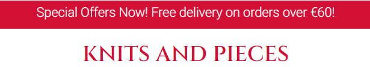

**Pass/Fail: Pass**

* **As a shopper I want to be able to easily view the total in euros of my purchases at any time so that I can take advantage of special information on products I'd like to purchase [#4](https://github.com/siobhanlgorman/knits-and-pieces/issues/4)**

**Acceptance Criteria**
- Basket total visible on basket icon from all pages with total amount in euros beside icon

**Testing Steps**:
1. Without logging in check basket icon and amount are visible in navbar (0euro if basket is empty)
2. Navigate to Shop page
3. Click on product image to open product detail
4. Click on add to basket
5. Check amount beside icon in navbar
6. Click on basket icon

**Expected Result**:
- Basket icon is visible in navbar - set to 0 when basket is empty
- Total amount updates as basket changes
- When clicked basket icon opens Shopping Basket page

**Actual Result**:
- Basket icon is visible in navbar with amount corresponding to basket total visible
- When clicked basket icon opens Shopping Basket page

**Pass/Fail: Pass**

* **As a shopper I want to be able to view more information about the store so that I can increase my confidence that the store is genuine, trustworthy and reliable to purchase from [#6](https://github.com/siobhanlgorman/knits-and-pieces/issues/6)**

**Acceptance Criteria**
- About page visible and linked in navigation

**Testing Steps**:
1. From the Home page navigation menu click the link for About

**Expected Result**:
- About Page opens

**Actual Result**:
- About Page opens when About link is clicked

**Pass/Fail: Pass**

*  **As a shopper I want to be able to view store's social media pages so that I can view the site content in different places that I use [#8](https://github.com/siobhanlgorman/knits-and-pieces/issues/8)**

**Acceptance Criteria**
- User can locate the store on Facebook and other social media sites (or links to social media main sites if no business page)

**Testing Steps**:
1. From any page navigate to the footer section
2. In turn click on Facebook, Twitter and Instagram icons

**Expected Result**:
1. When clicked Facebook icon opens Knits and Pieces Facebook business page in a new tab
2. When clicked Twitter and Instagram main page sites open in a new tab

**Actual Result**:
- When icons are clicked Knits and Pieces Facebook business page opens and Twitter and Instagram main pages open in new tabs

**Pass/Fail: Pass**

* **As a shopper I want to be able to easily register for an account so that I can have a personal account and be able to view my profile [#9](https://github.com/siobhanlgorman/knits-and-pieces/issues/9)**

**Acceptance Criteria**: User can register for an account with email and password

**Testing Steps**:
1. Make sure to be not logged in to the website and click on the profile icon in the navbar
2. Click on the Register link in the dropdown menu
3. In the register form click on the back to login button to check link
4. Repeat steps 1 and 2
5. Click on the sign up button without entering anything in the first field
6. Complete the first field and repeat step 5 for the other fields
7. With all fields complete click sign up

**Expected Result**:
1. Back to Login button links to sign in page
2. When information is incomplete or incorrect error message is displayed
3. When registration is complete success message appears asking the user to confirm their email address
4. Email is sent to user's email address with link to confirm email address
5. Link to confirm email address functions correctly

**Actual Result**:
1. Back to login and sign up links link correctly to sign in page
2. Error message displays when no or invalid text is entered
3. Success message asking user to confirm their email address appears when user has registered
4. Email is sent to user's email address with link to confirm email address
5. Link to confirm email address functions correctly

**Pass/Fail: Pass**

*  **As a registered shopper I want to be able to easily login and logout so that I can access my personal account information [#10](https://github.com/siobhanlgorman/knits-and-pieces/issues/10)**

**Acceptance Criteria**
- When user clicks on login/logout they can access My Account page

**Testing Steps**:
1. When not logged in click on profile icon in navigation menu
2. Click on login link
3. Complete username and password boxes
4. Click sign in button

**Expected Result**:
- User is signed in when information fields are completed
- User's information is automatically completed if they have checked the remember me box

**Actual Result**:
- User is signed in
- User's information is automatically completed if they have checked the remember me box
- During testing it was apparent that it would be useful to easily see which user was logged in so the username was added to the title in the My Profile page

**Pass/Fail: Pass**

*  **As a registered shopper I want to be able to easily recover my password if I forget it so that I can recover access to my account [#11](https://github.com/siobhanlgorman/knits-and-pieces/issues/11)**

**Acceptance Criteria**
- User can recover/change password

**Testing Steps**:
1. Click on profile icon in navigation menu
2. Click on login link
3. Click on forgot password link
4. Enter email address
5. Open email and click on link to reset password

**Expected Result**:
- Password is successfully changed and success message appears
- User is able to log in with new password

**Actual Result**:
- Password is successfully changed and success message appears
- User is able to log in with new password

**Pass/Fail: Pass**

*  **As a registered shopper I want to be able to receive an email confirmation after registering so that I can verify my account information/ registration was successful [#12](https://github.com/siobhanlgorman/knits-and-pieces/issues/12)**

**Acceptance Criteria**
- Email is sent to user account with confirmation link
- Confirmation link links to website confirmation page
- User is able to login with login credentials

**Testing Steps**:
1. Make sure to be not logged in to the website and click on the profile icon in the navbar
2. Click on the Register link in the dropdown menu
3. Complete the form fields as in User Story #9
4. Navigate to user's email account
5. Click on link in email to confirm email
6. Click on confirm button on website
7. Login with registration details

**Expected Result**:
1. Email is sent to user account with link to confirm address
2. When email link is clicked user is directed to website link to click to confirm email address.
3. Registration is confirmed with message.
4. User logs in with provided login information

**Actual Result**:
1. Email is sent to user account with link to confirm address
2. When email link is clicked user is directed to website link to click to confirm email address.
3. Registration is confirmed with message.
4. User logs in with provided login information

**Pass/Fail: Pass**

*  **As a registered shopper I want to be able to have a personalised user profile so that I can view my personal order history and order confirmations and save my payment information [#13](https://github.com/siobhanlgorman/knits-and-pieces/issues/13)**

**Acceptance Criteria**
1: User clicks on my profile icon in navigation to open profile
2: User can view delivery details and order history in my profile

**Testing Steps**:
1. When not logged in click on profile icon in navigation menu
2. Type https://knits-and-pieces.herokuapp.com/profile/ into the address bar
2. Log in and repeat step 1
2. Click on My Profile

**Expected Result**:
- User can view order history and delivery information for their own account when they click on My Profile
- If not logged in My Profile link is not visible
- When not logged in if user navigates to https://knits-and-pieces.herokuapp.com/profile/ they are redirected to the Sign In page

**Actual Result**:
- User can view order history and delivery information for their own account when they click on My Profile
- If not logged in My Profile link is not visible
- When not logged in if user navigates to https://knits-and-pieces.herokuapp.com/profile/ they are redirected to the Sign In page

**Pass/Fail: Pass**

*  **As a shopper I want to be able to sort the list of available products so that I can easily identify the best rated, best priced and items sorted by category [#14](https://github.com/siobhanlgorman/knits-and-pieces/issues/14)**

**Acceptance Criteria**
- User can sort all products by price and name from the navigation menu

**Testing Steps**:
1. Click on the Shop link in the navigation menu
2. Click on the By Price link in the dropdown menu
3. Click on the By Name link in the dropdown menu

**Expected Result**:
1. Products appear arranged by price in ascending order when By Price is clicked
2. Products appear arranged by name in ascending alphabetical order when By Name is clicked

**Actual Result**:
1. Products appear arranged by price in ascending order when By Price is clicked
2. Products appear arranged by name in ascending alphabetical order when By Name is clicked

**Pass/Fail: Pass**

*  As a shopper I want to be able to sort a specific category of items so that I can find the best priced, best rated product in a specific category or sort the products in that category by name [#15](https://github.com/siobhanlgorman/knits-and-pieces/issues/15)

**Acceptance Criteria**
1: User can select how to sort products from navigation
2: Badges display the categories viewed and can be clicked to narrow down categories
3: User can click on options in sort box to sort categories

**Testing Steps**:
1. Click on the Shop link in the navigation menu
2. Click on a category option link in the dropdown menu
3. Click on sort box and select each option in turn to sort by price/name/category
4. Repeat steps 1 to 3 for each category

**Expected Result**:
1. List of products in each category selected appears with category badge(s) listed above
2. When sort options are selected products are sorted by option and listed in correct ascending/descending order

**Actual Result**:
1. All products appear listed with all correct category badges listed above
2. When sort options are selected products are sorted by option and listed in correct ascending/descending order
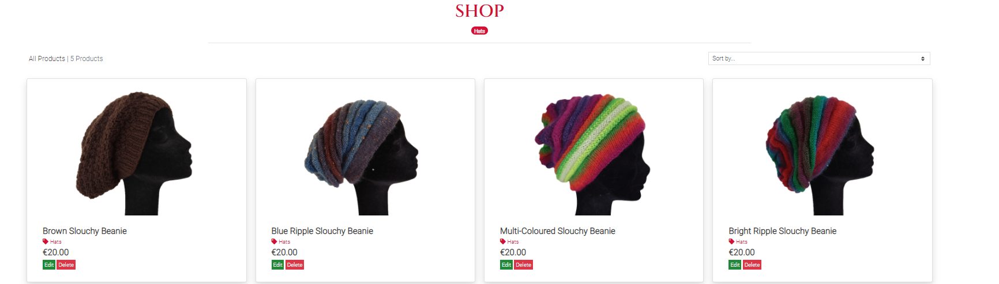
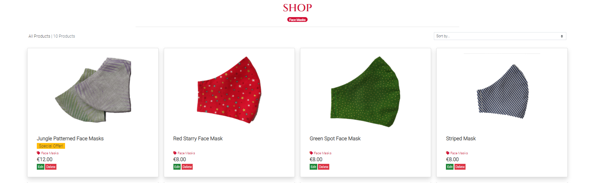

**Pass/Fail: Pass**

*  As a shopper I want to be able to sort multiple categories of products simultaneously so that I can find the best priced, best rated products across broad categories [#16](https://github.com/siobhanlgorman/knits-and-pieces/issues/16)

**Acceptance Criteria**: 
1. User can sort products by multiple categories when they select from the navigation menu dropdown
2. Badges display the categories viewed and can be clicked to narrow down categories
3. User can click on options in sort box to sort categories

**Testing Steps**:
1. Click on the Shop link in the navigation menu
2. Click on the All Products link in the dropdown menu
3. Click on sort box and select each option in turn to sort by price/name/category

**Expected Result**:
1. List of products appears with all category badges listed above
2. When a badge is clicked products are filtered to that category
2. When sort options are selected products are sorted by option and listed in correct ascending/descending order

**Actual Result**:

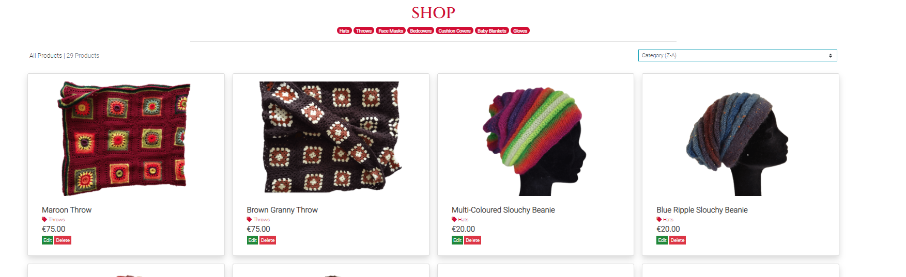

**Pass/Fail: Pass**

*  **As a shopper I want to be able to search for a product by name or description so that I can find a specific product to purchase [#17](https://github.com/siobhanlgorman/knits-and-pieces/issues/17)**

**Acceptance Criteria**
- User can search for product and results show found within name and description

**Testing Steps**:
1. Type single word into search box in navbar
2. Click search icon or enter
3. Repeat and enter empty search

**Expected Result**:
- Search results are listed with number of products found stated above list
- Results show search within title and descriptions
- When empty search is entered error message displays

**Actual Result**:

**Pass/Fail: Pass**

*  **As a shopper I want to be able to easily see what I have searched for and the number of results so that I can quickly see how many products are available [#18](https://github.com/siobhanlgorman/knits-and-pieces/issues/18)**

**Acceptance Criteria**
- Search page displays search item and number of results found above the display of search items

**Testing Steps**:
1. Type single word into search box in navbar
2. Click search icon or enter
3. Repeat and enter empty search

**Expected Result**:
1. Above products found list the search term and number of results is printed
2. If no results are found this is stated

**Actual Result**:
1. Search term and number of results are printed including if none found
2. Note that badges do not currently display for search results list which could be investigated for a later version

**Pass/Fail: Pass**

*  **As a shopper I want to be able to easily select the quantity of a product when purchasing it so that I can check that I am ordering the correct quantity that I intended [#19](https://github.com/siobhanlgorman/knits-and-pieces/issues/19)**

**Acceptance Criteria**
- User can select quantity of product to add to bag when looking at the product detail page

**Testing Steps**:
1. Click on Shop link in navbar
2. Click on item to test
3. Click on quantity selector box + and - in turn
4. Click on add to basket
5. Click on basket icon

**Expected Result**:
- Product quantity is updated in basket as selected

**Actual Result**:
- Product quantity is updated as selected
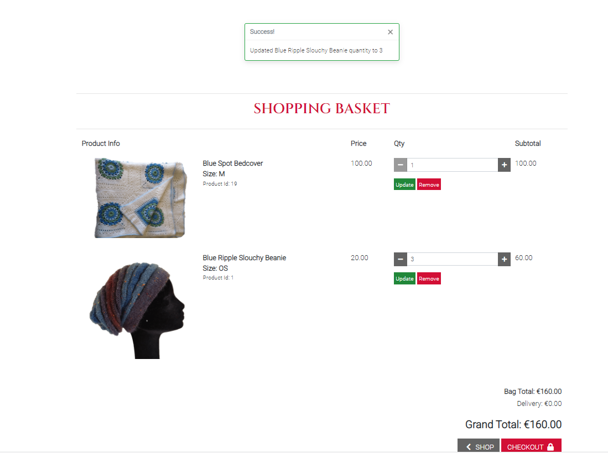

**Pass/Fail: Pass**

*  **As a shopper I want to be able to view items in my basket to be purchased so that I can see the total cost of my items and all the items I will receive [#20](https://github.com/siobhanlgorman/knits-and-pieces/issues/20)**

**Acceptance Criteria**
- Total cost of items in basket is viewable in navbar from all pages
- User can click on basket icon in navbar from any page to see contents

**Testing Steps**:

1. Follow steps in User Story #19 to add item(s) to basket
2. View basket icon in navbar
3. Click on basket icon in navbar

**Expected Result**:
1. Total cost of items in basket is viewable in navbar
2. Basket icon opens when clicked to full basket page

**Actual Result**:

**Pass/Fail: Pass**

*  **As a shopper I want to be able to adjust the quantity of individual items in my basket so that I can easily make changes to my purchase before checkout [#21](https://github.com/siobhanlgorman/knits-and-pieces/issues/21)**

**Acceptance Criteria**
1: User can click on quantity selector box in shopping basket
2: User can update the subtotal and grand total by clicking on update link

**Testing Steps**:
1. Click on Shop link in navbar
2. Click on item to test
3. Click on add to basket
4. Click on + and - selectors in turn
5. Click on update
6. Check total in basket and total in navbar
7. Click on remove

**Expected Result**:
- Items are updated in basket and navbar as expected with totals corresponding correctly
- Success message is displayed

**Actual Result**:
- Items are updated in basket and navbar as expected with totals corresponding correctly
- Success message os displayed

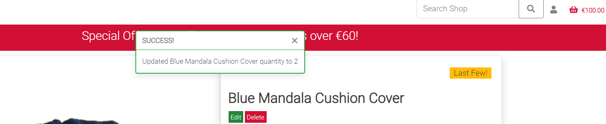

**Pass/Fail: Pass**

*  **As a shopper I want to be able to easily enter my payment information so that I can checkout quickly and easily [#22](https://github.com/siobhanlgorman/knits-and-pieces/issues/22)**
**Acceptance Criteria**
1: User clicks on checkout to complete payment form
2: Success message visible on completion of payment process

**Testing Steps**:
1. With items in basket and in basket page (follow previous steps) click Checkout button
2. Attempt to checkout without completing form fields correctly
3. Complete fields correctly
4. Complete card payment field with fake card details
5. Complete card payment with card number 4242 4242 4242 4242 

**Expected Result**:
1. Error message shows when fields are incorrectly completed
2. Error message shows when card number does not use test card number
3. Success message and order confirmation message displayed to user when order is completed
4. Payment success shown in Stripe dashboard
5. Stripe webhooks show payment intent and charge success

**Actual Result**:

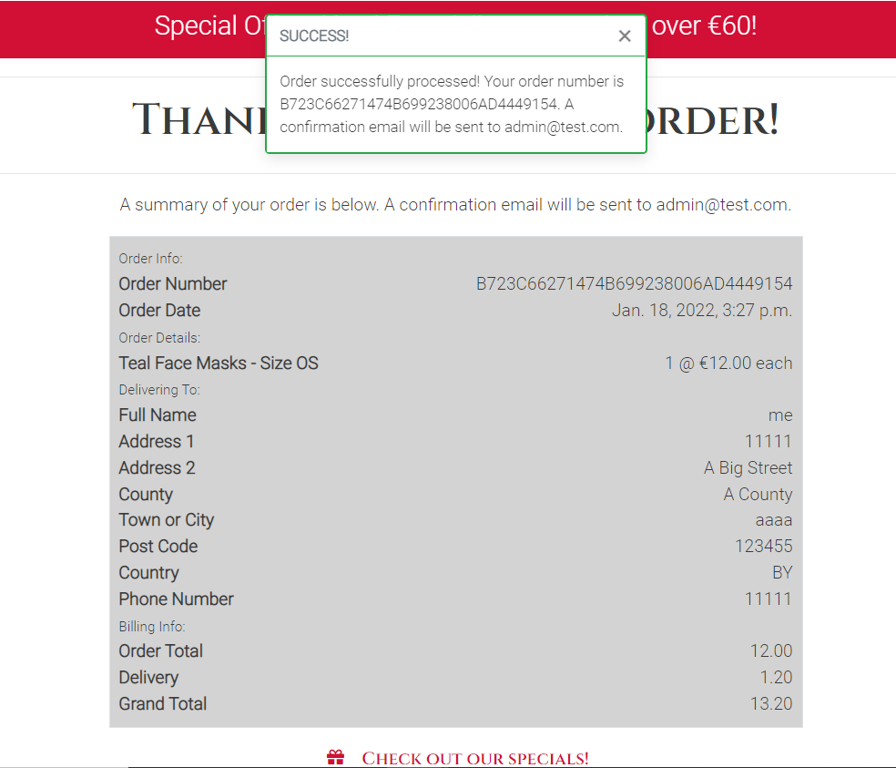

**Pass/Fail: Pass**

*  **As a shopper I want to be able to feel that my personal and payment information is safe and secure so that I can be confident in providing the necessary information to make a purchase [#23](https://github.com/siobhanlgorman/knits-and-pieces/issues/23)**

**Acceptance Criteria**
1. User receives success/error messages when completing order/payment
2. User can view order history in personalised profile when logged in
3. Padlock appears in site address bar indicating secure payment process and padlock in checkout button

**Testing Steps**:
1. Complete steps to make test purchase as outlined above
6. Click on profile icon in navbar
7. Click on My Profile link

**Expected Result**:
1. Padlock symbol appears in address bar during checkout process and padlock is on checkout button
2. Success message and order confirmation message displayed to user when order is completed
3. Email confirmation sent to user
4. Order appears in user's secure profile page

**Actual Result**:
1. Padlock symbol appears in address bar during checkout process and padlock is on checkout button
2. Success message and order confirmation message displayed to user when order is completed
3. Email confirmation sent to user
4. Order appears in user's secure profile page

**Pass/Fail: Pass**

*  **As a shopper I want to be able to view an order confirmation after checkout so that I can verify that the order is correct and as intended [#24](https://github.com/siobhanlgorman/knits-and-pieces/issues/24)**

**Acceptance Criteria**
- Order confirmation message is visible with all order details on screen on completion of purchase
**Testing Steps**:
- Complete test purchase steps as outlined above

**Expected Result**:
- Order confirmation message is visible with all order details on screen on completion of purchase

**Actual Result**:
- Order confirmation message is visible with all order details on screen on completion of purchase

*  **As a shopper I want to be able to receive an email confirmation after checking out so that I can have a record of my purchases [#25](https://github.com/siobhanlgorman/knits-and-pieces/issues/25)**

**Acceptance Criteria**
- User receives email confirmation in terminal with name, order information
- This user story has been tested as part of User Stories [22] and [23]

**Testing Steps**:
1. Follow steps outlined above to complete test purchase
2. Check user's email

**Expected Result**:
- Order confirmation email received

**Actual Result**:
- Order confirmation email received

**Pass/Fail: Pass**

*  **As a store owner I want to be able to add a product so that I can add new items to my store [#26](https://github.com/siobhanlgorman/knits-and-pieces/issues/26)**

**Acceptance Criteria**
1: Administrator can click on Add a Product to bring up add a product form
2: Administrator can add a product, save by clicking add product button and view product on site

**Testing Steps**:
When logged in as Administrator
1. Click on Profile icon in navbar
2. Click on Add Product
3. Complete product information fields incorrectly
4. Complete product information fields correctly
5. Click Cancel button
6. Repeat steps 1-4 and click Add Product
7. Navigate to Shop page by clicking on Shop link

**Expected Result**:
1. Invalid entries/missing fields are highlighted
2. Cancel button returns user to Shop page
3. Add Product button adds a Product to the Shop page
4. Success message displays
5. If no image added, placeholder image displays

**Actual Result**:

**Pass/Fail: Pass**

*  **As a store owner I want to be able to edit/update a product so that I can change product prices, descriptions, images and product criteria [#27](https://github.com/siobhanlgorman/knits-and-pieces/issues/27)**

**Acceptance Criteria**
1: Administrator can click on edit in product detail page to open up edit form
2: Administrator can edit and then click update product to save changes

**Testing Steps**:
1. When not logged in as admin/superuser click on All Products link in Shop dropdown navbar menu
2. View a product to check edit/remove buttons not visible
3. Log in as admin
4. Click on Edit button on product
5. In Edit Product form edit fields as required
6. Click on Update Product button
7. Check product details have changed by clicking to open product detail view from All Products page
9. Log out
10. Repeat steps 1-8 for product detail page by clicking on a product in the Shop to open up the detail page
11. Repeat steps 1-4 and click cancel

**Expected Result**:
- Edit/Remove buttons are not visible to non-admin users
- Product fields are updated when edit form is completed and Update PRoduct button is clicked
- Success message is displayed when product is updated
- When cancel button is clicked user is returned to Shop page

**Actual Result**:

**Pass/Fail: Pass**

*  **As a store owner I want to be able to delete a product so that I can remove items that are no longer for sale [#28](https://github.com/siobhanlgorman/knits-and-pieces/issues/28)**

**Acceptance Criteria**
- Administrator can click on delete in product detail page to delete a product

**Testing Steps**:
1. Click on All Products link in Shop dropdown navbar menu
2. Click on delete button on product in All Products Page
3. Check product is deleted in All Products page
4. Click on All Products link in Shop dropdown navbar menu
5. Click on Product to open up full product detail page
6. Click on delete button
7. Open up product detail page by clicking on product in All Products page 
8. Repeat step 2 - 5
9. Check product is deleted in All Products page

**Expected Result**:
1. Product has been deleted
2. Success message is displayed

**Actual Result**:

**Pass/Fail: Pass**

*  **As a shopper I want to be able to request a quote for a custom order so that I can purchase an item that meets my needs [#31](https://github.com/siobhanlgorman/knits-and-pieces/issues/31)**
**Acceptance Criteria**
- User can click to open custom order form and submit request for quote

**Testing Steps**:
1. Click on Order link in navbar menu
2. Click Request Quote to check empty field submission
3. Complete form fields
3. Click Request Quote button
4. Click on link to Order in footer

**Expected Result**:
1. User can submit custom order form from either navbar or footer links
2. Error messages display when fields are incorrectly completed when required
2. Success message displays
3. Order is visible in admin panel

**Actual Result**:
1. User can submit custom order form
2. Error messages display when fields are incorrectly completed when required
3. Success message displays when order is sent
4. Order is visible in admin panel

**Pass/Fail: Pass**

*  **As a shopper I want to be able to easily contact the store owner with any queries about the products so that I can find the answer to my questions [#32](https://github.com/siobhanlgorman/knits-and-pieces/issues/32)**

**Acceptance Criteria**
- User can click on contact envelope to send a message to Knits and Pieces
- User can click on Contact link in Quick Liks section in footer

**Testing Steps**:
1. Click on envelope icon in footer
2. Complete form fields first attempting to submit empty fields
3. Click on Send
4. Click on Contact link in footer

**Expected Result**:
1. Links to form in footer open up contact form
2. When fields are incorrectly completed error messages display
3. Message sent success message displays when message is sent
4. Success message displays when form is submitted
5. Contact Message appears in admin panel

**Actual Result**:
1. Links to form in footer open up contact form
2. When fields are incorrectly completed error messages display
3. Message sent success message displays when message is sent
4. Success message displays when form is submitted
5. Contact Message appears in admin panel

**Pass/Fail: Pass**

*  **As a shopper I want to be able to receive feedback from the website when I perform an interaction so that I can confirm an interaction has taken place and if an error has occurred [#33](https://github.com/siobhanlgorman/knits-and-pieces/issues/33)**

**Acceptance Criteria**
- Messages appears when user interacts with website

**Testing Steps**:
This has been throughly tested in the User Story testing above

**Expected Result**:
- Messages are displayed corresponding to user interaction

**Actual Result**:
Examples:

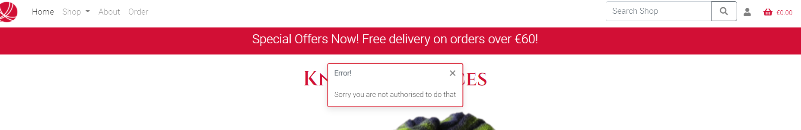

**Pass/Fail: Pass**

## Features Testing

### Navbar:

**Logo**

**Expected Result**: 
- Links to home page

**Testing Steps**:
- Click on logo in navbar menu

**Actual Result**:
- Links to home page

**Pass/Fail: Pass**

**Page Links**:

**Expected Result**:
- All links to pages link to the corresponding pages
- When the navigation page menu links are hovered over their colours are inverted to grey background and white font colour. 
- The text of the active page link is dark grey indicating the current active page

**Testing Steps**:
1. Navigate to navbar menu
2. Click on each page link in turn: Home, About, Order (Note Shop link opens a dropdown menu)
3. Repeat for collapsed menu

**Actual Result**:
- All page links work as expected
- Links change colour on hover
- The text of the active page link is dark grey indicating the current active page

**Pass/Fail: Pass**

**The Shop page link** features a dropdown menu. Users can choose to view all products or to sort or filter products by price, name or category. Categories which can be chosen from the menu are grouped together into broad categories that a customer might choose to see together: throws and blankets, hats and gloves, cushion covers and facemasks. When a category is selected the specific category badges appear above the products listing to enable the customer to further sort by category

**Expected Result**:
- Dropdown links open Shop page with relevant categories of products and respective category badges

**Testing Steps**:
1. Click on Shop link to open dropdown
2. Click on category option link
3. Repeat for all categories
4. Click on category badges

**Actual Result**:
1. Dropdown links work as expected
2. Badges are displayed correctly
3. Badges when clicked further sort categories

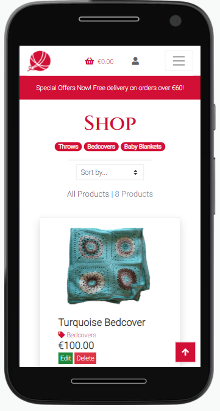

**Pass/Fail: Pass**

**Search Box** - On large screens a search box appears to the right of the top menu. Users can enter a single word to search within the title or description of a product. Users can click enter or the magnifying glass icon to enter the search. The products list is then filtered by the search term and resulting products are displayed with the number of results displayed above. If no products are found '0 products found' is displayed. On smaller screens the search box is contained in the burger dropdown menu.

**Expected Result**:
1. User can enter a search word into the search box
2. Above products found list the search term and number of results is printed
3. If no results are found this is stated
4. If empty search is entered error message is displayed

**Testing Steps**:
1. Type single word into search box in navbar
2. Click search icon or enter
3. Repeat and enter empty search

**Actual Result**:
1. Search term and number of results are printed including if none found
2. Error message displays if search is empty
3. Note that badges do not currently display for search results list which could be investigated for a later version

**Pass/Fail: Pass**

**Profile Icon**: On large screens the profile icon is to the right of the search box. This contains a dropdown menu which opens when clicked. For a user who is not logged in the options in the dropdown are links to the Register page and the Login page. For a user who is logged in the dropdown options are Add a Product, My Profile and Logout. For a user who is not logged in the dropdown options are Register and Login. On smaller screens the profile icon appears centrally to the right of the shopping basket.

**Expected Result**:
1. Profile icon dropdown menu opens as expected
2. Dropdown links link to correct pages
3. Logged in and Not logged in users see corresponding menu options

**Testing Steps**:
1. Without logging in click on Profile icon
2. Click on dropdown links and check they are correct
3. Click on Profile icon and click Login
4. Check Logged in User options appear
5. Check links work correctly

**Actual Result**:
- Links which appear correspond to user who is logged in and not logged in
- Links open to correct pages

**Pass/Fail: Pass**

**Shopping Basket** icon with total cost indicator: On large screens the shopping basket appears on the top right of the menu. When clicked the icon opens up the current basket page. Beside the basket is an indicator of the total cost of the items currently in the basket, also coloured red to match the basket. 

**Expected Result**:
1. When clicked the icon opens up the full current basket page. 
2. The indicator to the right of the basket icon indicates the total cost of the items currently in the basket
3. The indicator updates as items are added to tbe basket

**Testing Steps**:
1. Click on a product in All Products
2. Click on Add to Basket
2. Check that basket total updates in basket icon

**Actual Result**:
1. Total amount in basket is updated when product is added and total displays in navbar
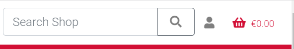

**Pass/Fail: Pass**

**Header** with navbar sticks to the top of the screen as the user scolls on larger screens but not on smaller screens where space is limited

**Expected Result**:
- Navigation menu remains displayed when scrolling for large screens but scrolls with smaller screens

**Testing Steps**:
1. On desktop view Home Page or any page start to scroll from top of screen
2. Repeat for mobile view

**Actual Result**:
- Navigation menu remains displayed when scrolling for large screens but scrolls with smaller screens

**Pass/Fail: Pass**

**A banner** is at the top of each page under the navbar, coloured in the crimson brand colour to draw attention to special information - the free delivery threshold and an embedded link to special offers/special items tagged items

**Expected Result**:
1. Banner displays correctly
2. Delivery threshold displays correctly
3. Link to special offers opens up filtered list of products with special tag

**Testing Steps**:
1. View website pages
2. Click link in banner

**Actual Result**:
- Banner displays correctly with delivery threshold
- Link to special offers opens up filtered list of products with special tag

**Pass/Fail: Pass**

**Footer**
- The footer is divided into three sections: Shop links to the shop products by category or tag, Quick Links to the main shop pages and a contact page, and a section with the social media and contact icons and newsletter links. The Facebook link links to a Facebook business page while the other social media links do not currently link directly to business pages as the business is not currently live. The subscribe button is to submit the email address in the input field below

**Expected Result**:
1. All links open up correct corresponding pages: the categories links open up filtered products by category and the pages link to the website pages: Home, About
2. The social media icons link to Knits and Pieces Facebook page, Twitter and Instagram main pages. 
3. When the user clicks on the Contact page link or the envelope icon the Contact page form opens.
4. The Subscribe button indicates the email form must be completed.
5. The SGorman link opens the developer's GitHub page

**Testing Steps**:
Click on each link in footer in turn and check correct page opens

**Actual Result**:
1. Shop links to the shop products by category or tag
2. Quick Links opens to the main shop pages
3. Contact envelope icon opens the contact page form 
4. Social media icons link to Knits and Pieces Facebook page, Twitter and Instagram main pages- The social media links include a direct link to FB business page 
5. Logo opens the home page
6. The Subscribe button indicates the email form must be completed.

**Pass/Fail: Pass**

### Home Page
**Carousel**: Under the title is a carousel featuring images of three main product categories with links in the image title to the relevant category page

**Expected Result**:
- Carousel is functioning with three images displaying

**Testing Steps**:
- Navigate to Home page

**Actual Result**:
- Carousel is functioning with three images displaying

**Pass/Fail: Pass**

- Under the carousel is some **introductory text** about the store and an embedded link to the Order page where Users can order a custom item

**Expected Result**:
- Link to order form links correctly

**Testing Steps**:
- Click on 'order'

**Actual Result**:
- Link to order form links correctly

**Pass/Fail: Pass**
- Below the text are **two CTA buttons** one to the main Shop page and the other to the About page with more information about the store. 
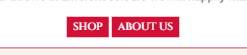

**Expected Result**:
1. Shop button links to All Products page with category badge listed
2. About Us button links to About page

**Testing Steps**:
- Click on each link in turn

**Actual Result**:
1. Shop button links to All Products page with category badge listed
2. About Us button links to About page

**Pass/Fail: Pass**

### About Page
- Features a photograph of the store owner with information about the history of the store. 
- CTA button to the Shop page

**Expected Result**:
- CTA button to the Shop page links correctly to open products page with category badges

**Testing Steps**:
1. Navigate to About Page by clicking on link in navbar menu
2. Click on Shop button

**Actual Result**:
- CTA button to the Shop page links correctly to open products page with category badges

**Pass/Fail: Pass**

### Shop Page - Products

**Expected Results**:
1. When all products is selected in the navigation menu the products are listed in rows of four on extra-large screens, three on large screens, two on medium and one on small screens
2. Above the products list on the left on medium screens and up and is text specifying the number of products. 
3. Above the products list on the right is a sort selector box to sort products by category, price, name
4. The number of products text and sort selector box appear in the centre above the products list on small screens
5. Each product image in the product list links to its product detail page
6. Product category label inside product card lnks to list of all products of that category
7. Edit/delete buttons are visible only to superuser/administrator under the product price
8. Category badges are visible above the products list

**Testing Steps**:
1. Navigate to Shop page by clicking on All Products in Shop navbar dropdown menu
2. Check view on large, medium and small sized screens
3. Click on product images to open product detail
4. If logged as Administrator check that edit/delete buttons are visible
5. If not logged as Administrator check that edit/delete buttons are not visible
6. Login/Logout as Administrator to check the visibility of edit/delete buttons
7. Click on category label

**Actual Result**:
1. When all products is selected in the navigation menu the products are listed in rows of four on extra-large screens, three on large screens, two on medium and one on small screens
2. Above the products list on the left on medium screens and up and is text specifying the number of products. 
3. Above the products list on the right is a sort selector box to sort products by category, price, name
4. The number of products text and sort selector box appear in the centre above the products list on small screens
5. Each product image in the product list links to its product detail page
6. Product category label inside product card lnks to list of all products of that category
7. Edit/delete buttons are visible to superuser/administrator only under the product price
8. Category badges are visible above the products list

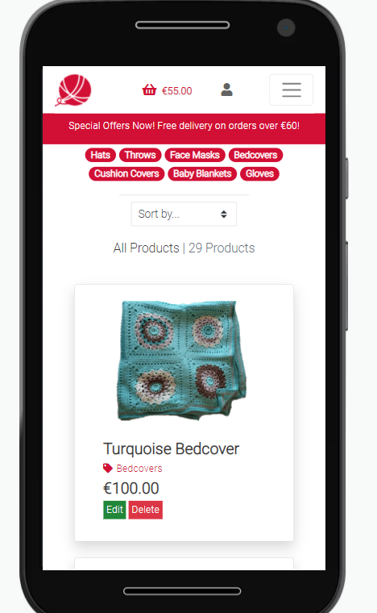

**Pass/Fail: Pass**

### Product Detail Page

**Product Details**- This page features a large image of the product and product detail information specific to each product as not all fields apply to all products.

**Expected Result**:
1. Each product detail page features a large image of the product
2. Product details can be seen on the page as appropriate - name, price, description, colours(1-4), material, size, machine washable, designer. Can custom design for example is only visible on throws which can be custom ordered. No empty fields should be seen. Also tags ('special offer' etc) are not on all products
3. If the item is available to be custom ordered (currently only the various blankets), this is viewable in the description with a link to the custom order page

**Testing Steps**:
1. Navigate to the Product detail page by clicking on an item in the products page
2. Check display fields are not empty

**Actual Results**:
1. Product detail page features a large image of the product
2. Product details can be seen on the page as appropriate with no empty fields
3. Items available to be custom ordered (currently only the various blankets) have this field in the product detail page. 
4. Link to the custom order page is working correctly

**Pass/Fail: Pass**

**Category label**

**Expected Result**:
- Category label can be clicked to view more of this category

**Testing Steps**:
- Click on category label within Product Detail page

**Actual Result**:
- Category label can be clicked to view more of this category

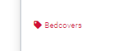

**Pass/Fail: Pass**

**Edit/Delete buttons**

**Expected Result**:
1. Edit/delete buttons are visible to superuser/administrator under the product name
2. Edit/delete buttons are not visible to user who is not a superuser/administrator
3. Edit button when clicked opens Update product form
4. Cancel button returns user to Shop page
5. User is able to complete and submit form when required fields are filled
6. Empty required fields yield error message and form cannot be submitted
7. Update Product button function updates product information
8. Delete button when clicked deletes product
9. Success message displays after update or delete function is completed

**Testing Steps**:
1. Navigate to product detail page when not logged in as administrator
2. Repeat step 1 after logging in as administrator
For these steps please create a test product by clicking on the Profile item in the navbar and then clicking Add a Product and completing the fields
3. Open the test product created in product detail view
4. Click on Edit button
5. Leave fields empty and click Update Product
5. Complete product information fields correctly
6. Click Cancel button
7. Repeat steps 1-4 and click Update Product
8. Navigate to Shop page by clicking on Shop link
9. Locate test product and click Delete

**Actual Result**:
1. Edit/delete buttons are visible to superuser/administrator under the product name
2. Edit/delete buttons are not visible to user who is not a superuser/administrator
3. Edit button when clicked opens Update product form
4. Cancel button returns user to Shop page
5. User is able to complete and submit form when required fields are filled
6. Empty required fields yield error message and form cannot be submitted
7. Update Product button function updates product information
8. Delete button when clicked deletes product
9. Success message displays after update or delete function is completed

**Pass/Fail: Pass**

**Quantity selector box**

**Expected Result**:
1. The + and - selector buttons increase/decrease quantity number inside the box. 
2. Users can also enter number or use arrows inside box to increase/decrease quantity of item

**Testing Steps**:
1. Click on Shop link in navbar
2. Click on item to test
3. Click on quantity selector box + and - in turn
4. Click on add to basket
5. Click on basket icon

**Actual Result**:
1. The + and - selector buttons increase/decrease quantity number inside the box. 
2. Users can also enter number or use arrows inside box to increase/decrease quantity of item

**CTA buttons: Shop/Add to Basket**
**Expected Result**:
1. Shop button returns users to the All Products Shop page
2. The Add to Basket button adds the selected number in the input box of items to the shopping basket correctly
3. Add to basket button adds the number of items selected in the box to the basket

**Testing Steps**:
1. Click on All Products in Shop drowdown in navbar
2. Click on product to open product detail
3. Click on Shop button
4. Repeat steps 1-3
5. Click on the quantity selector to change the quantity of items then click Add to Basket
6. Click on the basket item to confirm change has been made

**Actual Result**:
1. Shop button returns users to the All Products Shop page
2. The Add to Basket button adds the selected number in the input box of items to the shopping basket correctly
3. Add to basket button adds the number of items selected in the box to the basket

**Pass/Fail: Pass**

### Order Page - Custom Order
- This page features a form for the user to request a quote to custom order a throw or blanket to their size and colour specifications. At the top of the page is a carousel of pattern images from which customer can select the design they wish to order in the form. Below the carousel is a form for user to input name, email, choice of sizes/material/up to four colour choices and a design. Default options are set for size and material and a default of 'mix' for design if the user has no preference. Name, email and main colour are required fields for the user to input.  Further details can also be entered in a message box. A request quote button clearly indicates the purpose of the form and submits the form.

**Expected Result**:
1. Carousel functions with all images displaying
2. User can input text into form input boxes and empty fields display error message
3. Request quote button submits form
4. Form appears in admin panel

**Testing Steps**:
1. Click on Order link in navbar menu
2. Complete form fields, leaving empty first
3. Click Request Quote

**Actual Result**:
1. Carousel functions with all images displaying
2. User can input text into form input boxes and empty fields display error message
3. Request quote button submits form
4. Form appears in admin panel

**Pass/Fail: Pass**

### Add a Product Page

- This page can only be accessed by the administrator/superuser and is only visible in the navbar menu if the user is logged in as administrator or superuser.
- This page features a form for the administrator/superuser to add a product with fields from the product model: category options, name, size options, description, optional tag, price, material (with default acrylic), machine wash checkbox with default checked, image selection box, up to four colour selction boxes with at least one required, pattern name, deigner and whether the item can be custom ordered with no as default.
- The form to edit a product accessed by the admistrator from the products or product detail page is the same form as for add a product with the fields auto completed which can be changed by the administrator.

**Acceptance Criteria**
1: Administrator can click on Add a Product to bring up add a product form
2: Administrator can add a product, save by clicking add product button and view product on site

**Testing Steps**:
When logged in as Administrator
1. Click on Profile icon in navbar
2. Click on Add Product
3. Complete product information fields incorrectly
4. Complete product information fields correctly
5. Click Cancel button
6. Repeat steps 1-4 and click Add Product
7. Navigate to Shop page by clicking on Shop link

**Expected Result**:
1. Invalid entries/missing fields are highlighted
2. Cancel button returns user to Shop page
3. Add Product button adds a Product to the Shop page
4. Success message displays
5. If no image added, placeholder image displays

**Actual Result**:

**Pass/Fail: Pass**

### My Profile Page
- The link to this page can only be seen if a user is logged in
- On the left the default delivery information is displayed if the user has selected save my information during the chackout process.
- The user can change the default information by entering information into the fields
- A green update button is below the delivery information form which can be clicked to submit and save changed information
- This page can only be accessed by the user who is signed in
- On the right the user's order history is displayed in a table with order number, date of order, items ordered and the order total. The Order number is truncated but on hover the full number can be viewed. On click the full past order confirmation is displayed

**Expected Result**:
1. Link is only visible if user is logged in and can only be accessed by this user
2. User's saved delivery information is visible
3. Default delivery information can be changed and saved
4. The update button functions to save and update infomation
5. User's order history is displayed
6. When the order number is hovered over the full number is visible
7. When the order number is clicked the past order confirmation is opened

**Testing Steps**:
1. When not logged in click on Profile icon in navbar
2. Repeat step 1 after logging in
3. Click My Profile in Profile dropdown menu
3. Complete or change delivery information
4. Click update
5. Log out
6. Repeat steps 2-3
7. Hover over order number
8. Click on order number

**Actual Result**:

1. Link is only visible if user is logged in and can only be accessed by this user
2. User's saved delivery information is visible
3. Default delivery information can be changed and saved
4. The update button functions to save and update infomation
5. User's order history is displayed
6. When the order number is hovered over the full number is visible
7. When the order number is clicked the past order confirmation is opened

**Pass/Fail: Pass**

### Contact Page
- Accessed from envelope icon in footer and Contact link in Quick Links in footer
- Features a form with input fields: name, subject, email address and text box for a message
- All fields are required so that site owner has the necessary information to reply
- At the bottom of the form is a Send button to submit the message

**Acceptance Criteria**
- User can click on contact envelope to send a message to Knits and Pieces

**Testing Steps**:
1. Click on envelope icon in footer
2. Complete form fields first attempting to submit empty fields
3. Click on Send

**Expected Result**:
1. When fields are incorrectly completed error messages display
2. Message sent success message displays when message is sent
3. Success message displays when form is submitted
4. Message appears in admin panel

**Actual Result**:
1. When fields are incorrectly completed error messages display
2. Error message displays when required fields are not completed
3. Success message displays when form is submitted
4. Message appears in admin panel

**Pass/Fail: Pass**

### Register Page
- Features a form with input boxes for email and email confirmation, username, password and password confirmation
- Two buttons, signup and back to login page

**Acceptance Criteria**: User can register for an account with email and password

**Testing Steps**:

1. Make sure to be not logged in to the website and click on the profile icon in the navbar
2. Click on the Register link in the dropdown menu
3. In the form click on the back to login button
4. Repeat steps 1 and 2
5. Repeat steps 1 and 2 and click on sign in link
6. Reapeat steps 1 and 2
7. Click on the sign up button without entering anything in the first field
8. Complete the first field and repeat step 7 for the other fields

**Expected Result**:

1. Back to Login button links to sign in page
2. When information is incomplete or incorrect error message is displayed
3. When registration is complete success message appears asking the user to confirm their email address

**Actual Result**:

1. Back to login and sign up links link correctly to sign in page
2. Error message displays when no or invalid text is entered
3. Success message asking user to confirm their email address appears when user has registered

**Pass/Fail: Pass**

### Login Page

- Features a form with input boxes for required fields username and password
- Two buttons are featured at the bottom of the form for home and sign in

**Acceptance Criteria**

- When user clicks on login/logout they can access My Account page

**Testing Steps**:

1. When not logged in click on profile icon in navigation menu
2. Click on login link
3. Complete username and password boxes
4. Click sign in button

**Expected Result**:

- User is signed in
- User's information is automatically completed if they have checked the remember me box

**Actual Result**:
- User is signed in
- User's information is automatically completed if they have checked the remember me box

**Pass/Fail: Pass**

### Logout Page

**Acceptance Criteria**

- When user clicks on logout they can access My Account logout page
- User can sign out from the sign out form

**Testing Steps**:

1. When logged in click on profile icon in navigation menu
2. Click on logout link
3. Click Sign Out button

**Expected Result**:

1. Logout link in profile menu links to SIgn Out form
2. User is signed out

**Actual Result**:

1. Logout link in profile menu links to SIgn Out form
2. User is signed out

**Pass/Fail: Pass**

### Basket Page

- Features summary information of products added to basket: image of products, title, size, price, delivery cost and total
- A quantity selector box can be used to changed the quantity of basket items
- Two buttons are visible to update quantity total and remove items in one go from the basket
- Two CTA buttons are at the bottom of the form for users to return to the shop or checkout

* Summary information

**Expected Result**:

- Summary information of items in basket clearly displayed and updated: image of products, title, size, price, delivery cost and total

**Testing Steps**:

1. Click on Shop link in navbar then All Products in dropdown
2. Click on item to test purchase
4. Click on add to basket
5. Click on basket icon to open basket and view contents

**Actual Result**:

- Summary information of items in basket clearly displayed and updated: image of products, title, size, price, delivery cost and total

**Pass/Fail: Pass**

* Quantity Selector box

**Expected Result**:

- A quantity selector box can be used to changed the quantity of basket items
- Selector does not go below 1

**Testing Steps**:

1. First complete steps 1 - 5 above to add product to basket and view contents
2. Click on quantity selector box + and - in turn, 

**Actual Result**:

- A quantity selector box can be used to changed the quantity of basket items
- Selector does not go below 1

**Pass/Fail: Pass**

* Buttons: Update/Remove

**Expected Result**:

1. Update button updates quantity total to number selcted in quantity selector box
2. Subtotal and Grand totals are updated
3. remove items in one go from the basket
4. Success messages are displayed when update and remove actions are performed

**Testing Steps**:

1. Complete steps above to add product to basket
2. Change the quantity of item in basket using quantity selector
3. Click on update and check subtotal and grand total
4. Click on remove and check that item has been removed

**Actual Result**:

1. Update button updates quantity total to number selcted in quantity selector box
2. Subtotal and Grand totals are updated
3. Remove button removes items in one go from the basket
4. Success messages are displayed when update and remove actions are performed

**Actual Result**:

**Pass/Fail: Pass**

* Buttons: Shop/Checkout

**Expected Result**:

1. The Shop button returns the user to the Shop page
2. The Checkout button opens the Checkout and payment page

**Testing Steps**:

1. Complete steps above to add product to basket
2. Click the Shop button
3. Return to the Basket page by clicking on the basket icon in the navbar
4. Click on the Checkout button

**Actual Result**:

1. The Shop button returns the user to the Shop page
2. The Checkout button opens the Checkout and payment page

### Checkout Page

- The Checkout page features input boxes for the necessary payment information inputs: name, email, phone number, street address, town or city, country, post code, country
- At the bottom is the box for card payment information for Stripe. For testing purposes the number 4242 4242 4242 4242 is used
- Two selectors are at the bottom to return to adjust the basket or complete order buttons to complete the payment process

**Expected Result**:
1. User can complete payment process and submit order
2. User cannot checkout without completing required fields
3. Logged in user's email address is prefilled

**Testing Steps**:
1. With items in basket and in basket page (follow previous steps) click Checkout button
2. Attempt to checkout without completing form fields correctly
3. Complete fields correctly
4. Complete card payment field with fake card details
5. Complete card payment with card number 4242 4242 4242 4242 

**Expected Result**:
1. Error message shows when fields are incorrectly completed
2. Error message shows when card number does not use test card number
3. Success message and order confirmation message displayed to user when order is completed
4. Email confirmation sent to user
5. Payment success shown in Stripe dashboard
6. Stripe webhooks show payment intent and charge success
7. Order email confirmation received by customer

**Actual Result**:

**Actual Result**:

**Pass/Fail: Pass**

**Test Case**

* To fully test the complete experience from registration to payment a new user Jack was created and taken through the full process. Two small bugs were found during this process (See Bugs section) Screenshots below:

 
 

#### Messages
**Expected Result**:
- Feedback Messages are displayed after every user interaction on the website
**Testing Steps**:
- This has been thoroughly tested as part of the User Story testing and Features testing above
**Actual Result**:
- Feedback Messages are displayed after every user interaction on the website

Sample screenshots

**Pass/Fail: Pass**

## Browser Compatibility
Additional tests were conducted on Mozilla Firefox and Microsoft Edge with no issues detected

## Responsiveness
The project was developed on Google Chrome and no issues were detected. Chrome Development tools was used throughout development to test responsiveness and then after deployment was additionally tested on android Moto G8 plus, IPhone SE2

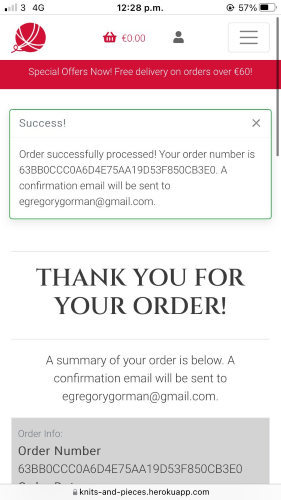

## Bugs and Fixes
1. Toast success message doesn't display if same item is added again to basket. Fix: Error in if statement in bag/views.py
2. Image media url not working. FIx - add media context processor in settings.py
3. Can-custom design - displaying text by default - FIX incorrect format of if statement
4. Zip code error - indefinite number of numbers and error message pointing to order - error in views.py keys had values which were strings not variables ('' around the variables) - FIX '' removed
5. Checkout_success no reverse match found although payment in stripe succeeded. Discovered order number not being generated. Fix: Narrowed issue down to order generation in models.py update total function and found indentation errors.
6. Error after adding countryfield - could not migrate. Folder still looking for max value of 2. Eventually deleted all orders in the database as they were created wth countries longer than 2 letters. Then the migration worked.
7. After creating profile and linking to order history two orders being created in db with two different numbers. Fix - corrected stripe billing and shipping name fields. Due to subsequent ongoing issues with duplicate orders being created and non-recognition of two name fields in billing and shipping information, the order model field was reverted to full name and first and last name fields removed as they can be accessed from using the full name method
8. Remove button bug with W3C validator - two ids as element on mobile and desktop views at same time (hidden on one). Fix: Id changed to data-id
9. During testing bug found relating to checkbox - address saved to profile whether checkbox checked or not
10. During testing bug found that address line 2 in order confirmation saved as address line 1 - FIxed found error in checkout_success.html

11. Stripe time is wrong - possibly due to registering while in Spain (+ 1hour) - fixed but some screenshots may show 1 hour time difference
12. Chrome on android no longer seems to update changes on refreshing pages: fixed by clearing last week's browsing history each time checking on Moto G8+

## Code Validation

### HTML Validation

HTML was validated by [The W3C Markup Validation Service](https://validator.w3.org/)

* Home app
- index.html

- about.html

- privacy.html

* Products app

Add a Product Page
- add_product.html

Edit a Product Page
- edit_product.html

Product Detail Page
- product_detail.html

Shop Page

- products.html

Shopping Basket Page
- bag.html

Checkout Page
- checkout.html

* Profile Page

- profile.html
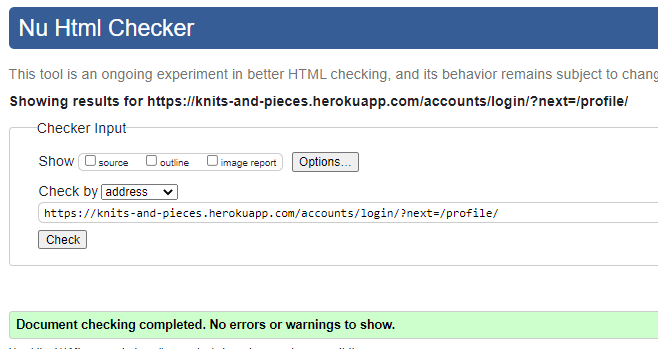

Custom Order Page

- custom.html

Contact Page

- contact.html

Register Page

- signup.html

Sign In Page

- login.html

Sign Out Page

- logout.html

Confirmation Email Page ???

### CSS Validation
CSS was validated by [The W3C CSS Validation Service](https://jigsaw.w3.org/css-validator/)

- About Page

- Home Page

Custom Order Page

Contact Page

No errors were found on checking the two CSS files:
- base.css
- checkout.css

### PEP 8 Validation

The following files were checked:

* Bag app:
- bag_tools.py

- apps.py
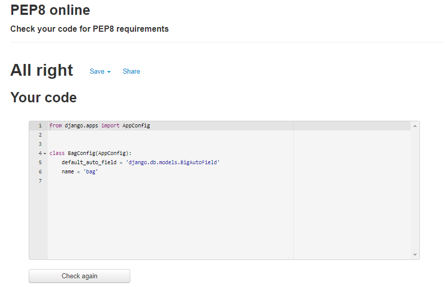

- contexts.py

- urls.py

- views.py
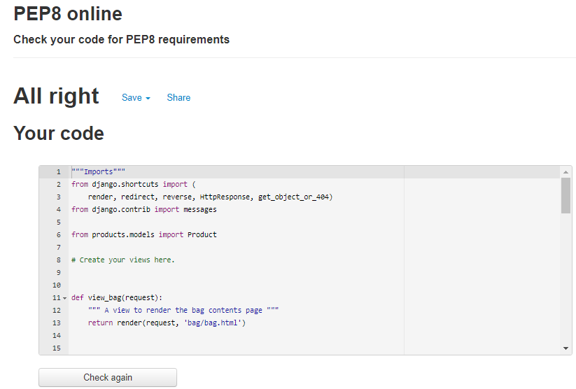

* Checkout app:
- admin.py

- apps.py

- forms.py

- models.py

- signals.py

- urls.py

- views.py

- webhook_handler.py

- webhooks.py

* Contact app
- admin.py

- apps.py

- forms.py

- models.py

- urls.py

- views.py

* Custom app
- admin.py

- apps.py
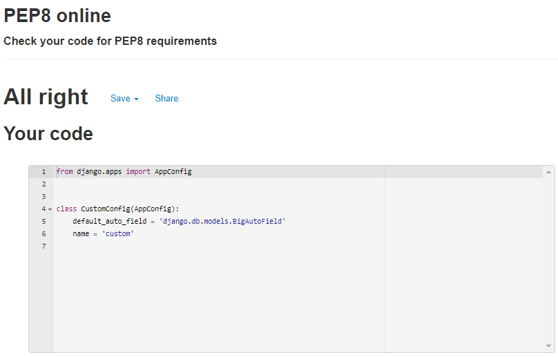

- forms.py

- models.py

- urls.py

- views.py

* Home app
* Knits and Pieces
- settings.py

- urls.py

- views.py

- apps.py

* Products app
- admin.py

- apps.py

- forms.py

- models.py

- urls.py

- views.py

- widgets.py

* Profiles app
- admin.py

- apps.py

- forms.py

- models.py

- urls.py

- views.py

### JS
The following JavaScript files were checked with [JS Hint](https://jshint.com/)

* Checkout app
- stripe_elements.js

* Profiles app
- countryfield.js

- custom_storages.py

## Lighthouse Scores
## Accessibility