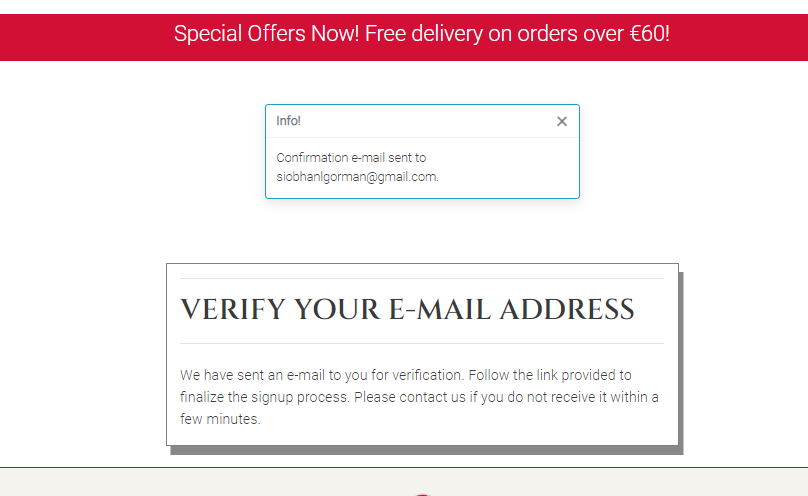

# Knits and Pieces Testing
## Manual Testing
Thorough testing was conducted by the developer and multiple users among friends and family especially with order creation, updating totals, editing line items. Bugs were found and fixed as detailed below in Bugs section. Testing steps and results are detailed as follows.

## User Stories Testing

For User Story testing first navigate to the [Knits and Pieces website](https://knits-and-pieces.herokuapp.com/)

* As a shopper I want to be able to view a list of products[#1](https://github.com/siobhanlgorman/knits-and-pieces/issues/1) so that I can select some to purchase

**Acceptance Criteria**: User can view list of products with image, title and price on Shop page

**Testing Steps**:
1. Click on Shop link in navigation menu to open dropdown menu
2. Click on All Products link to open up Shop page
3. Click on Category link??

**Expected Result**:
- Shop page opens
- Products diplay
- Image and summary detail are visible
- Links in product card work correctly??

**Actual Result**:
- Shop page with list of individual products is displayed

* As a shopper I want to be able to view individual products with all relevant details[#2](https://github.com/siobhanlgorman/knits-and-pieces/issues/2) so that I can select some to purchase

**Acceptance Criteria**: User can click on product image or text in Shop page to open full page detail
**Testing Steps**:
1. From the Shop page (see User Story test #1), click on a product image

**Expected Result**:
- Product detail card opens when product image is clicked
- Full product detail card is displayed
- All links in card work correctly??????

**Actual Result**:
- Product detail card displays

* As a shopper I want to be able to easily identify special information about products eg discounts[#3](https://github.com/siobhanlgorman/knits-and-pieces/issues/3) so that I can see the price, description, material, product image and size

**Acceptance Criteria**:  Tag is visible on products tagged with special information e.g. 'last few remaining', 'special offer' etc on Shop page and Product Detail Page. Products with tags can be accessed from navigation meny and link in banner

**Testing Steps**:
1. Click on Shop link in navigation menu to open dropdown menu
2. Click on Don't Miss link
1. Click on Home link in navigation menu to return to Home page
2. Click on Special Offers now in banner

**Expected Result**:
- Don't Miss link in navigation dropdown opens list of tagged products
- Special Offers Now link in banner opens list of tagged products

**Actual Result**:
- Don't Miss link in navigation dropdown opens list of tagged products
- Special Offers Now link in banner opens list of tagged products

* As a shopper I want to be able to easily view the total in euros of my purchases at any time[#4](https://github.com/siobhanlgorman/knits-and-pieces/issues/4) so that I can take advantage of special information on products I'd like to purchase

**Acceptance Criteria**
- Basket total visible on basket icon from all pages with total amount in euros beside icon

**Testing Steps**:
1. Check basket icon and amount ar visible in navbar
2. Navigate to Shop page
3. Click on product image to open product detail
4. Click on add to basket
5. Check amount beside icon in navbar
6. Click on basket icon

**Expected Result**:
- Basket icon is visible in navbar
- Total amount updates as basket changes
- When clicked basket icon opens Shopping Basket page

**Actual Result**:
- Basket icon is visible in navbar with amount corresponding to basket total visible
- When clicked basket icon opens Shopping Basket page

* As a shopper I want to be able to view more information about the store[#6](https://github.com/siobhanlgorman/knits-and-pieces/issues/6) so that I can increase my confidence that the store is genuine, trustworthy and reliable to purchase from

**Acceptance Criteria**
- About page visible and linked in navigation

**Testing Steps**:
1. From the Home page navigation menu click the link for About

**Expected Result**:
- About Page opens

**Actual Result**:
- About Page opens when About link is clicked

*  As a shopper I want to be able to view store's social media pages[#8](https://github.com/siobhanlgorman/knits-and-pieces/issues/8) so that I can view the site content in different places that I use

**Acceptance Criteria**
- User can locate the store on facebook and other social media sites (or link to social media main site if no business page)

**Testing Steps**:
1. From any page navigate to the footer section
2. In turn click on facebook, twitter, instagram icons

**Expected Result**:
1. When clicked Facebook icon opens Knits and Pieces Facebook business page in a new tab
2. When clicked Twitter and Instagram main page sites open in a new tab

**Actual Result**:
- When icons are clicked Knits and Pieces Facebook business page opens and Twitter and Instagram main pages open in new tabs

*  As a shopper I want to be able to easily register for an account[#9](https://github.com/siobhanlgorman/knits-and-pieces/issues/9) so that I can have a personal account and be able to view my profile

**Acceptance Criteria**: User can register for an account with email and password

**Testing Steps**:
1. Make sure to be not logged in to the website and click on the profile icon in the navbar
2. Click on the Register link in the dropdown menu
3. In the form click on the back to login button
4. Repeat steps 1 and 2
5. Repeat steps 1 and 2 and click on sign in link
6. Reapeat steps 1 and 2
7. Click on the sign up button without entering anything in the first field
8. Complete the first field and repeat step 7 for the other fields

**Expected Result**:
1. Back to Login button links to sign in page
2. When information is incomplete or incorrect error message is displayed
3. When registration is complete success message appears asking the user to confirm their email address

**Actual Result**:
1. Back to login and sign up links link correctly to sign in page
2. Error message displays when no or invalid text is entered
3. Success message asking user to confirm their email address appears when user has registered

*  As a registered shopper I want to be able to easily login and logout[#10](https://github.com/siobhanlgorman/knits-and-pieces/issues/10) so that I can access my personal account information

**Acceptance Criteria**
- When user clicks on login/logout they can access My Account page

**Testing Steps**:
1. Click on profile icon in navigation menu
2. Click on login link
3. Complete username and password boxes
4. Click sign in button

**Expected Result**:
- User is signed in
- User's information is automatically completed if they have checked the remember me box

**Actual Result**:
- User is signed in
- User's information is automatically completed if they have checked the remember me box

*  As a registered shopper I want to be able to easily recover my password if I forget it[#11](https://github.com/siobhanlgorman/knits-and-pieces/issues/11) so that I can recover access to my account

**Acceptance Criteria**
- User can recover/change password from user profile

**Testing Steps**:
1. Click on profile icon in navigation menu
2. Click on login link
3. Click on forgot password link
4. Enter email address
5. Open email and click on link to reset password

**Expected Result**:
- Password is successfully changed and success message appears
- User is able to log in with new password

**Actual Result**:

*  As a registered shopper I want to be able to receive an email confirmation after registering[#12](https://github.com/siobhanlgorman/knits-and-pieces/issues/12) so that I can verify my account information/ registration was successful

**Acceptance Criteria**
- Email is sent to user account with confirmation link
- Confirmation link links to website confirmation page
- User is able to login with login credentials

**Testing Steps**:
1. Make sure to be not logged in to the website and click on the profile icon in the navbar
2. Click on the Register link in the dropdown menu
3. Complete the form fields as in User Story #9
4. Navigate to user's email account
5. Click on link in email to confirm email
6. Click on confirm button on website
7. Login with registration details

**Expected Result**:
1. Email is sent to user account with link to confirm address
2. When email link is clicked user is directed to website link to click to confirm email address.
3. Registration is confirmed with message.
4. User logs in with provided login information

**Actual Result**:
1. Email is sent to user account with link to confirm address
2. When email link is clicked user is directed to website link to click to confirm email address.
3. Registration is confirmed with message.
4. User logs in with provided login information

*  As a registered shopper I want to be able to have a personalised user profile[#13](https://github.com/siobhanlgorman/knits-and-pieces/issues/13) so that I can view my personal order history and order confirmations and save my payment information

**Acceptance Criteria**
1: User clicks on my profile icon in navigation to open profile
2: User can view delivery details and order history in my profile

**Testing Steps**:
1. Click on profile icon in navigation menu
2. Click on My Profile

**Expected Result**:
1. User can view ordere history and delivery information for their own account when they click on My Profile
**Actual Result**:

*  As a shopper I want to be able to sort the list of available products[#14](https://github.com/siobhanlgorman/knits-and-pieces/issues/14) so that I can easily identify the best rated, best priced and items sorted by category
**Acceptance Criteria**
**Testing Steps**:
**Expected Result**:
**Actual Result**:

*  As a shopper I want to be able to sort a specific category of items[#15](https://github.com/siobhanlgorman/knits-and-pieces/issues/15) so that I can find the best priced, best rated product in a specific category or sort the products in that category by name
**Acceptance Criteria**
**Testing Steps**:
**Expected Result**:
**Actual Result**:

*  As a shopper I want to be able to sort multiple categories of products simultaneously[#16](https://github.com/siobhanlgorman/knits-and-pieces/issues/16) so that I can find the best priced, best rated products across broad categories
**Acceptance Criteria**
**Testing Steps**:
**Expected Result**:
**Actual Result**:

*  As a shopper I want to be able to search for a product by name or description[#17](https://github.com/siobhanlgorman/knits-and-pieces/issues/17) so that I can find a specific product to purchase
**Acceptance Criteria**
**Testing Steps**:
**Expected Result**:
**Actual Result**:

*  As a shopper I want to be able to easily see what I have searched for and the number of results[#18](https://github.com/siobhanlgorman/knits-and-pieces/issues/18) so that I can quickly see how many products are available
**Acceptance Criteria**
**Testing Steps**:
**Expected Result**:
**Actual Result**:

*  As a shopper I want to be able to easily select the quantity of a product when purchasing it[#19](https://github.com/siobhanlgorman/knits-and-pieces/issues/19) so that I can check that I am ordering the correct quantity that I intended
**Acceptance Criteria**
**Testing Steps**:
**Expected Result**:
**Actual Result**:

*  As a shopper I want to be able to view items in my basket to be purchased[#20](https://github.com/siobhanlgorman/knits-and-pieces/issues/20) so that I can see the total cost of my items and all the items I will receive
**Acceptance Criteria**
**Testing Steps**:
**Expected Result**:
**Actual Result**:

*  As a shopper I want to be able to adjust the quantity of individual items in my basket[#21](https://github.com/siobhanlgorman/knits-and-pieces/issues/21) so that I can easily make changes to my purchase before checkout
**Acceptance Criteria**
**Testing Steps**:
**Expected Result**:
**Actual Result**:

*  As a shopper I want to be able to easily enter my payment information[#22](https://github.com/siobhanlgorman/knits-and-pieces/issues/22) so that I can checkout quickly and easily
**Acceptance Criteria**
**Testing Steps**:
**Expected Result**:
**Actual Result**:

*  As a shopper I want to be able to feel that my personal and payment information is safe and secure[#23](https://github.com/siobhanlgorman/knits-and-pieces/issues/23) so that I can be confident in providing the necessary information to make a purchase
**Acceptance Criteria**
**Testing Steps**:
**Expected Result**:
**Actual Result**:

*  As a shopper I want to be able to view an order confirmation after checkout[#24](https://github.com/siobhanlgorman/knits-and-pieces/issues/24) so that I can verify that the order is correct and as intended
**Acceptance Criteria**
**Testing Steps**:
**Expected Result**:
**Actual Result**:

*  As a shopper I want to be able to receive an email confirmation after checking out[#25](https://github.com/siobhanlgorman/knits-and-pieces/issues/25) so that I can have a record of my purchases
**Acceptance Criteria**
**Testing Steps**:
**Expected Result**:
**Actual Result**:

*  As a store owner I want to be able to add a product[#26](https://github.com/siobhanlgorman/knits-and-pieces/issues/26) so that I can add new items to my store
**Acceptance Criteria**
**Testing Steps**:
**Expected Result**:
**Actual Result**:

*  As a store owner I want to be able to edit/update a product[#27](https://github.com/siobhanlgorman/knits-and-pieces/issues/27) so that I can change product prices, descriptions, images and product criteria
**Acceptance Criteria**
**Testing Steps**:
**Expected Result**:
**Actual Result**:

*  As a store owner I want to be able to delete a product[#28](https://github.com/siobhanlgorman/knits-and-pieces/issues/28) so that I can remove items that are no longer for sale
**Acceptance Criteria**
**Testing Steps**:
**Expected Result**:
**Actual Result**:

*  As a shopper I want to be able to request a quote for a custom order[#31](https://github.com/siobhanlgorman/knits-and-pieces/issues/31) so that I can purchase an item that meets my needs
**Acceptance Criteria**
**Testing Steps**:
**Expected Result**:
**Actual Result**:

*  As a shopper I want to be able to easily contact the store owner with any queries about the products[#32](https://github.com/siobhanlgorman/knits-and-pieces/issues/32) so that I can find the answer to my questions
**Acceptance Criteria**
**Testing Steps**:
**Expected Result**:
**Actual Result**:

*  As a shopper I want to be able to receive feedback from the website when I perform an interaction[#33](https://github.com/siobhanlgorman/knits-and-pieces/issues/1) so that I can confirm an interaction has taken place and if an error has occurred
**Acceptance Criteria**
**Testing Steps**:
**Expected Result**:
**Actual Result**:

## Features Testing

**Expected Result**:
**Testing Steps**:
**Actual Result**:

* Navbar
- Logo - Ball of wool in crimson brand colour. links to home page. Sits on left as is usual.
- Page Links: On large screens the main page links are on the left: Home, Shop, About and Order pages. - On medium screens and smaller the main page links are compressed into a burger menu icon on the right which opens into a dropdown menu on the right
- The Shop page link features a dropdown menu. Users can choose to view all products or to sort or filter products by price, name or category. Categories which can be chosen from the menu are grouped together into broad categories that a customer might choose to see together: throws and blankets, hats and gloves, cushion covers and facemasks. When a category is selected the specific category badges appear above the products listing to enable the customer to further sort by category
- Search Box - On large screens a search box appears to the right of the top menu. Users can enter a single word to search within the title or description of a product. Users can click enter or the magnifying glass icon to enter the search. The products list is then filtered by the search term and resulting products are displayed with the number of results displayed above. If no products are found '0 products found' is displayed. On smaller screens the search box is contained in the burger dropdown menu.
- Profile Icon: On large screens the profile icon is to the right of the search box. This contains a dropdown menu which opens when clicked. For a user who is not logged in the options in the dropdown are links to the Register page and the Login page. For a user who is logged in the dropdown options are Add a Product, My Profile and Logout. On smaller screens the profile icon appears centrally to the right of the shopping basket.
- Shopping Basket: On large screens the shopping basket appears on the top right of the menu. The basket is coloured red in keeping with the brand colur and to make it stand out in the menu. When clicked the icon opens up the current basket page. Beside the basket is an indicator of the total cost of the items currently in the basket, also coloured red to match the basket. On smaller screens the basket icon is positioned centrally to the left of the profile icon.
- When the navigation page menu links are hovered over their colours are inverted to grey background and white font colour. 
- Header with navbar sticks to the top of the screen as the user scolls on larger screens but not on smaller screens where

* A banner is at the top of each page under the navbar, coloured in the crimson brand colour to draw attention to special information - the free delivery threshold and an embedded link to special offers/special items tagged items

* Footer
- The footer is divided into three sections: Shop links to the shop products by category or tag, Quick Links to the main shop pages and a contact page, and a section with the social media and contact icons and newsletter links. 
- When the user clicks on the Contact page link or the envelope icon the Contact page form opens. The two links to the contact contact page are only found in the footer as this is where the user expects to find them. 
- The social media links include a direct link to FB business page while the other social media links do not currently link directly to business pagea as the business is not currently live. 
- At the bottom is copyright information and a link to the developer's GitHub page. 
- On medium and large screens the shop links are on the left, quick links on the right and social media, newsletter, copyright in the middle section. On smaller screens the Shop links are at the top, followed by newsletter and social media, then Quick Links and copyright at the bottom. 
- The footer also features the brand logo image in the center which links to the home page.
- The Subscribe section contains an embedded mailchimp signup form with CTA Subscribe button and an input box to enter the user's email address
- A Page title features prominently on all pages in the title font and the brand colour.

#### Home Page
- Under the title is a carousel featuring images of three main product categories with links in the image title to the relevant category page
- Under the carousel is some introductory text about the store and an embedded link to the Order page where Users can order a custom item
- Below the text are two CTA buttons one to the main Shop page and the other to the About page with more information about the store. 

#### About Page
- Features a photograph of the store owner with information about the history of the store. 
- CTA button to the Shop page
- On larger screens the photo and text appear side by side which collapses to one underneath the other on smaller screens

#### Shop Page - Products
- When all products is selected in the navigation menu the product are listed in rows of four on extra-large screens, three on large screens, two on medium and one on small screens
- Above the products list on the left on medium screens and up is text specifying the number of products. 
- Above the products list on the right is a sort selector box to sort products by category, price, name
- The number of products text and sort selector box appear in the centre above the products list on small screens
- Each product image in the product list links to its product detail page
- Edit/delete buttons are visible to superuser/administrator under the product price
- When products listed have been selected by category in the navigation menu, category badges are seen from where the user can further sort the products

#### Product Detail Page
- Each product detail page features a large image of the product
- Product details - name, price, description, colours(1-4), material, size, machine washable, designer
- If the item is available to be custom ordered (currently only the various blankets), this is viewable in the description with a link to the custom order page
- Category label can be clicked to view more of this category
- Edit/delete buttons are visible to superuser/administrator under the product name
- A quantity selector box with + - selector to increase/decrease quantity of item. Usere can also enter number or use arrows inside box to increase/decrease quantity of item
- Two buttons - one grey to return to main Shop page and one crimson to add item(s) to shopping basket
- On larger screens the photo appears on the left and description to the right which collapses vertically into two coloumns on smaller screens

#### Order Page - Custom Order
- This page features a form for the user to request a quote to custom order a throw or blanket to their size and colour specifications
- At the top of the page is a carousel of pattern images from which customer can select the design they wish to order in the form
- Below the carousel is a form for user to input name, email, choice of sizes/material/up to four colour choices and a design. Default options are set for size and material and a default of 'mix' for design if the user has no preference. Name, email and main colour are required fields for the user to input.  Further details can also be entered in a message box.
- A request quote button clearly indicates the purpose of the form and submits the form.

#### Add a Product Page
- The Add a Product page can only be accessed by the administrator/superuser and is only visible in the navbar menu is te user is logged in as administrator or superuser.
- This page features a form for the administrator/superuser to add a product with fields from the product model: category options, name, size options, description, optional tag, price, material (with default acrylic), machine wash checkbox with default checked, image selection box, up to four colour selction boxes with at least one required, pattern name, deigner and whether the item can be custom ordered with no as default.
- The form to edit a product accessed by the admistrator from the products or product detail page is the same form as for add a product with the fields auto completed which can be changed by the administrator.

#### My Profile Page
- The link to this page can only be seen if a user is logged in
- On the left the default delivery information is displayed if the user has selected save my information during the chackout process.
- The user can change the default information by entering information into the fields
- A green update button is below the delivery information form which can be clicked to submit and save changed information
- This page can only be accessed by the user who is signed in
- On the right the user's order history is displayed in a table with order number, date of order, items ordered and the order total. The Order number is truncated but on hover the full number can be viewed. On click the full past order confirmation is displayed

#### Contact Page
- Accessed from envelope icon in footer and Contact link in Quick Links in footer
- Features a form with input fields: name, subject, email address and text box for a message
- All fields are required so that site owner has the necessary information to reply
- At the bottom of the form is a Send button to submit the message

#### Register Page
- Features a form with input boxes for email and email confirmation, username, password and password confirmation
- Two buttons, signup and back to login page

#### Login Page
- Features a form with input boxes for required fields username and password
- Two buttons are featured at the bottom of the form for home and sign in

#### Basket Page
- Features summary information of products added to basket: image of products, title, size, price, delivery cost and total
- A quantity selector box can be used to changed the quantity of basket items
- Two buttons are visible to update quantity total and remove items in one go from the basket
- Two CTA buttons are at the bottom of the form for users to return to the shop or checkout

#### Checkout Page
- The Checkout page features input boxes for the necessary payment information inputs: name, email, phone number, street address, town or city, country, post code, country
- At the bottom is the box for card payment information for Stripe. For testing purposes the number 4242 4242 4242 4242 is used
- Two selectors are at the bottom to return to adjust the basket or complete order buttons to complete the payment process

#### Messages
- Feedback messages are shown whenever the user interacts with the site.
???????

## Browser Compatibility
## Responsiveness
## Bugs and Fixes
1. Toast success message doesn't display if same item is added again to basket. Fix: Error in if statement in bag/views.py
2. Image media url not working. FIx - add media context processor in settings.py
3. Can-custom design - displaying text by default - FIX incorrect format of if statement
4. Zip code error - indefinite number of numbers and error message pointing to order - error in views.py keys had values which were strings not variables ('' around the variables) - FIX '' removed
5. Checkout_success no reverse match found although payment in stripe succeeded. Discovered order number not being generated. Fix: Narrowed issue down to order generation in models.py update total function and found indentation errors.
6. Error after adding countryfield - could not migrate. Folder still looking for max value of 2. Eventually deleted all orders in the database as they were created wth countries longer than 2 letters. Then the migration worked.
7. After creating profile and linking to order history two orders being created in db with two different numbers. Fix - corrected stripe billing and shipping name fields. Due to subsequent ongoing issues with duplicate orders being created and non-recognition of two name fields in billing and shipping information, the order model field was reverted to full name and first and last name fields removed as they can be accessed from using the full name method
8. Remove button bug with W3C validator - two ids as element on mobile and desktop views at same time (hidden on one). Fix: Id changed to data-id
9. Error when scrolling in empty basket relating to btt button javascript

## Code Validation
### HTML Validation
HTML was validated by [The WEC Markup Validation Service](https://validator.w3.org/)

No errors or warnings were found:

Home Page: 

About Page:

Custom Order Page

Contact Page

Register Page

Sign In Page

Sign Out Page

Confirmation Email Page

Sign Out Page

Sign Out Page

### CSS Validation

### PEP 8 Validation

The following files were checked:

* **#/views.py**

* **#/views.py**

* **models.py**

* **forms.py**

* **urls.py**

* **admin.py**

## Lighthouse Scores
## Accessibility